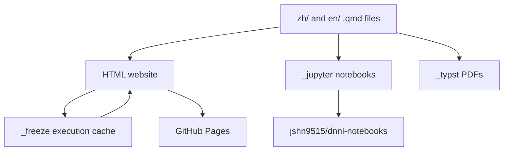

# 项目架构

本仓库是 Deep Learning Notes 网站、生成的 Notebook 镜像、Typst PDF 构建以及配套 `dnnlpy` Python 包的来源。

## 源码布局

- `zh/` 和 `en/` 包含 `.qmd` 格式的 Quarto 源章节。
- `_quarto-html.yml` 定义网站构建。
- `_quarto-jupyter.yml` 定义 Notebook 构建。
- `_quarto-typst-en.yml` 和 `_quarto-typst-zh.yml` 定义 PDF 构建。
- `_freeze/` 存储已提交的 Quarto 执行结果。
- `dnnlpy/` 包含笔记使用的 Python 包。
- `.github/workflows/` 包含 CI、发布、渲染、Notebook 同步以及包发布工作流。

## 内容构建流程

主要内容以 `zh/` 和 `en/` 目录下的 Quarto Markdown 文件为起点。不同的工作流会将这些文件渲染为不同目标。



## HTML 网站发布工作流

HTML 网站由 `.github/workflows/quarto-publish.yml` 构建。

当代码推送到 `main` 分支时，该工作流会运行 `quarto render --profile html`。HTML profile 使用 `_quarto-html.yml`，通过 Jupyter 执行代码，并使用 Quarto freeze 与执行缓存：

- `execute.freeze: auto`
- `execute.cache: true`
- 输出目录：`_site`

在渲染之前，工作流会按明确的优先级合并两个缓存来源：

1. 已提交的 `_freeze/` 目录拥有最高优先级，并且始终会被使用。
2. 当依赖没有变化时，GitHub Actions 缓存会作为次级来源使用。
3. 如果 `dnnlpy/` 或根目录的 `pyproject.toml` 发生变化，工作流会跳过恢复 GitHub Actions 缓存，但仍保留已提交的 `_freeze/` 目录。

实际执行时，工作流会临时保存仓库中的 `_freeze/`，在允许时恢复 GitHub Actions 缓存，然后再将保存的仓库 `_freeze/` 覆盖回去。这样会让已提交的 `_freeze/` 条目覆盖 GitHub Actions 缓存中的同名条目。渲染完成后，Quarto 会将更新后的执行结果写回 `_freeze/`。该工作流会将 `_freeze/` 作为 `quarto-cache` artifact 上传，同时 GitHub Actions cache action 会存储更新后的缓存，供之后的运行使用。

HTML 渲染还会通过 profile 的 post-render hooks 运行 `utils/generate_toc.py`。当需要时，发布工作流会将生成的 `zh/README.md` 和 `en/README.md` 变更提交回仓库。

## Pull Request 渲染检查

Pull request 使用 `.github/workflows/pr-render-check.yml`。

Pull request 遵循相同的缓存优先级规则。已提交的 `_freeze/` 目录始终会被使用。只有在依赖没有变化时，才会恢复 GitHub Actions 缓存；并且 PR 运行使用 `actions/cache/restore`，因此可以读取缓存但不会写回新的缓存。这样可以避免 PR 污染共享的渲染缓存。

## Jupyter Notebook 打包工作流

Notebook 打包由 `.github/workflows/package-notebooks.yml` 处理。

该工作流会在以下情况下运行：

- 推送到 `main` 且变更涉及 `zh/**`、`en/**` 或该工作流本身；
- 每月定时运行；
- 手动触发。

它使用以下命令渲染 notebooks：

```bash
quarto render zh/ --profile jupyter
quarto render en/ --profile jupyter
```

Jupyter profile 定义在 `_quarto-jupyter.yml` 中。它会将 `.qmd` 文件转换为 `.ipynb`，但不执行代码：

```yaml
execute:
  enabled: false
```

生成的 notebooks 会写入 `_jupyter/`，然后按语言分别打包成归档文件、生成 attestations，并作为工作流 artifacts 上传。

## Jupyter Notebook 同步工作流

Notebook 打包工作流还会将生成的 notebooks 同步到 `jshn9515/dnnl-notebooks`。

打包完成后，它会向 Notebook 镜像仓库发送 repository dispatch 事件：

- `sync-dnnl-zh`
- `sync-dnnl-en`

dispatch payload 包含源仓库、工作流运行 ID、artifact 名称、归档文件名以及语言。下游镜像仓库随后可以下载已上传的 Notebook 归档文件并更新自身。这些 notebooks 由本仓库生成，目标是可以直接在 Google Colab 中打开。

## Typst PDF 编译工作流

PDF 生成由以下配置文件定义：

- `_quarto-typst-en.yml`
- `_quarto-typst-zh.yml`

这些 profiles 会将 Quarto 源文件编译为 Typst/PDF，但不执行代码：

```yaml
execute:
  enabled: false
```

Typst 输出会先写入 `_typst/en` 和 `_typst/zh`。随后，`utils/rename_pdf.py` 会将它们移动为稳定的顶层文件名：

- `_typst/deep-learning-notes-en.pdf`
- `_typst/deep-learning-notes-zh.pdf`

截至本文写作时，尚没有专门用于 Typst PDF 发布的 GitHub Actions 工作流文件。PDF 构建由 Quarto Typst profiles 及配套工具脚本定义。

## `dnnlpy` 包 CI 工作流

dnnlpy 包 CI 工作流是 `.github/workflows/dnnlpy-ci.yml`。

当 `dnnlpy/**`、`pyproject.toml` 或该工作流本身发生变化时，它会运行。该工作流会在 Python 3.12、3.13 和 3.14 上测试该包：

```yaml
matrix:
  python-version: ["3.12", "3.13", "3.14"]
```

对于每个 Python 版本，工作流会：

1. 使用 ruff 检查格式；
2. 使用 `uv python install` 安装请求的 Python 版本；
3. 使用 `uv venv --python` 创建隔离的虚拟环境；
4. 使用 `uv pip install --python .venv --torch-backend cpu -e "dnnlpy[test]"` 安装包；
5. 使用 `.venv/bin/python -m pytest dnnlpy/tests` 运行测试；
6. 使用 `uv build dnnlpy --out-dir dist` 构建包的 wheel 和源码分发包；
7. 生成 artifact attestations；
8. 上传包 artifacts。

> [!NOTE]
> 隔离虚拟环境是有意为之。由于 uv workspace 的限制，如果通过根 workspace 测试 `dnnlpy`，包测试会被耦合到根项目的 Python 版本要求。`dnnlpy` 包本身支持 Python 3.12 到 3.14，因此用户可以在其他平台上安装它，包括 Google Colab。

## PyPI 和 TestPyPI 发布

包发布拆分在以下工作流中：

- `.github/workflows/release-testpypi.yml`
- `.github/workflows/release-pypi.yml`

两个工作流都会在 GitHub Releases 和手动触发时运行。每个工作流都会先在 Python 3.12、3.13 和 3.14 上运行 `dnnlpy` 测试矩阵。只有在该矩阵通过后，发布才会开始。

测试 jobs 使用与 `dnnlpy-ci.yml` 相同的隔离虚拟环境模式：安装请求的 Python 版本、创建 `.venv`、使用 `uv pip install --torch-backend cpu` 安装 `dnnlpy[test]`，并运行 `.venv/bin/python -m pytest dnnlpy/tests`。

发布 jobs 会使用 Python 3.14 和 `uv build dnnlpy --out-dir dist` 构建一次，并通过 trusted publishing 发布：

- TestPyPI 使用 `uv publish --publish-url https://test.pypi.org/legacy/`。
- PyPI 使用 `uv publish`。

`testpypi` 和 `pypi` GitHub environments 控制最终发布门禁。PyPI environment 预期会延迟一小时，以便在真正的 PyPI 发布继续之前检查 TestPyPI。

## 手动网站发布

`.github/workflows/manual-publish.yml` 提供了网站发布流程的手动版本。

它暴露两个输入：

- `use_cache`：渲染前是否恢复 Quarto freeze 缓存；
- `commit_back`：是否将生成的 `zh/README.md` 和 `en/README.md` 变更提交回仓库。

当网站需要在不等待常规 push 触发的发布运行时重新构建或部署时，该工作流很有用。

## 依赖更新

Renovate 配置在 `.github/renovate.json` 中。

Renovate app 会按照常规定时检查仓库，大约每四小时一次，并创建依赖更新 pull requests。当前配置：

- 使用 `config:recommended`；
- 替换版本范围，而不是扩大版本范围；
- 将 PR 分配给 `jshn9515`；
- 给依赖 PR 添加 `dependencies` 和 `python` 标签；
- 禁用 PEP 621 依赖的 patch 更新；
- 禁用 GitHub Actions 的 patch 和 minor 更新。

Renovate PR 会走正常的 pull request 处理路径：它们可以使用已提交的 `_freeze/` 缓存，但涉及依赖变更的 PR 会避免恢复共享的 GitHub Actions 缓存。
