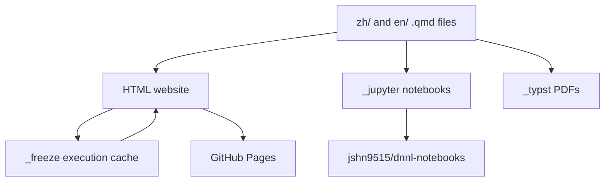

# Project Architecture

This repository is the source of truth for the Deep Learning Notes website, the generated notebook mirror, the Typst PDF builds, and the companion `dnnlpy` Python package.

## Source Layout

- `zh/` and `en/` contain the Quarto source chapters in `.qmd` format.
- `_quarto-html.yml` defines the website build.
- `_quarto-jupyter.yml` defines the notebook build.
- `_quarto-typst-en.yml` and `_quarto-typst-zh.yml` define the PDF builds.
- `_freeze/` stores committed Quarto execution results.
- `dnnlpy/` contains the Python package used by the notes.
- `.github/workflows/` contains the CI, publishing, rendering, notebook sync, and package publishing workflows.

## Content Build Flow

The main content starts as Quarto Markdown files under `zh/` and `en/`. Different workflows render those files into different targets.



## HTML Website Workflow

The HTML website is built by `.github/workflows/quarto-publish.yml`.

On pushes to `main`, the workflow runs `quarto render --profile html`. The HTML profile uses `_quarto-html.yml`, executes code with Jupyter, and uses Quarto freeze and execution cache:

- `execute.freeze: auto`
- `execute.cache: true`
- Output directory: `_site`

Before rendering, the workflow protects the committed `_freeze/` directory:

1. Save the repository `_freeze/` directory into `/tmp/repo_freeze`.
2. Remove `_freeze/`.
3. Restore the GitHub Actions `_freeze` cache.
4. Overlay the repository `_freeze/` back on top.

This gives committed `_freeze/` files higher priority than the Actions cache. After rendering, Quarto writes updated execution results back into `_freeze/`. The workflow uploads `_freeze/` as a `quarto-cache` artifact, and the GitHub Actions cache action stores the updated cache for future runs.

The HTML render also runs `utils/generate_toc.py` through the profile post-render hooks. The publish workflow commits generated `zh/README.md` and `en/README.md` changes back to the repository when needed.

## Pull Request Render Checks

Pull requests use `.github/workflows/render-check.yml`.

The PR workflow renders the site with the same HTML profile, but it uses `actions/cache/restore` only. It can read a cache, but it does not store a new cache back. This keeps PRs from poisoning the shared render cache.

The PR workflow also detects dependency or package changes. If files under `dnnlpy/` or the root `pyproject.toml` changed, the workflow does not restore the GitHub Actions freeze cache. In that case, it keeps only the repository `_freeze/` files, because those are committed and represent the highest-priority cache for computationally expensive notebooks.

## Jupyter Notebook Workflow

Notebook packaging is handled by `.github/workflows/package-notebooks.yml`.

This workflow runs on:

- Pushes to `main` that touch `zh/**`, `en/**`, or the workflow itself;
- A monthly schedule;
- Manual dispatch.

It renders notebooks with:

```bash
quarto render zh/ --profile jupyter
quarto render en/ --profile jupyter
```

The Jupyter profile is defined in `_quarto-jupyter.yml`. It converts `.qmd` files to `.ipynb` without executing code:

```yaml
execute:
  enabled: false
```

The generated notebooks are written to `_jupyter/`, packaged as language-specific archives, attested, and uploaded as workflow artifacts.

## Notebook Sync Workflow

The notebook packaging workflow also syncs generated notebooks to `jshn9515/dnnl-notebooks`.

After packaging, it sends repository dispatch events to the notebook mirror:

- `sync-dnnl-zh`
- `sync-dnnl-en`

The dispatch payload includes the source repository, workflow run ID, artifact name, archive name, and language. The downstream mirror repository can then download the uploaded notebook archive and update itself. These notebooks are generated from this repository and are intended to be opened directly in Google Colab.

## Typst PDF Flow

PDF generation is configured by:

- `_quarto-typst-en.yml`
- `_quarto-typst-zh.yml`

These profiles compile the Quarto sources to Typst/PDF without executing code:

```yaml
execute:
  enabled: false
```

The Typst outputs are first written under `_typst/en` and `_typst/zh`. `utils/rename_pdf.py` then moves them into stable top-level filenames:

- `_typst/deep-learning-notes-en.pdf`
- `_typst/deep-learning-notes-zh.pdf`

At the time of writing, there is no dedicated GitHub Actions workflow file for Typst PDF publishing. The PDF build is defined by the Quarto Typst profiles and the supporting utility scripts.

## `dnnlpy` Package Workflow

The package CI workflow is `.github/workflows/dnnlpy-ci.yml`.

It runs when `dnnlpy/**`, `pyproject.toml`, or the workflow itself changes. The workflow tests the package across Python 3.12, 3.13, and 3.14:

```yaml
matrix:
  python-version: ["3.12", "3.13", "3.14"]
```

For each Python version, the workflow:

1. Checks formatting with Ruff;
2. Installs the requested Python version with `uv python install`;
3. Creates an isolated virtual environment with `uv venv --python`;
4. Installs the package with `uv pip install --python .venv --torch-backend cpu -e "dnnlpy[test]"`;
5. Runs tests with `.venv/bin/python -m pytest dnnlpy/tests`;
6. Builds the package wheel and source distribution with `uv build dnnlpy --out-dir dist`;
7. Generates artifact attestations;
8. Uploads the package artifacts.

> [!NOTE]
> The isolated virtual environment is intentional. Because of uv workspace limitations, testing `dnnlpy` through the root workspace would couple the package tests to the root project Python requirement. The `dnnlpy` package itself supports Python 3.12 through 3.14 so users can install it on other platforms, including Google Colab.

## PyPI and TestPyPI Publishing

Package publishing is split across:

- `.github/workflows/release-testpypi.yml`
- `.github/workflows/release-pypi.yml`

Both workflows run on GitHub Releases and manual dispatch. Each workflow first runs the `dnnlpy` test matrix across Python 3.12, 3.13, and 3.14. Publishing only starts after that matrix passes.

The test jobs use the same isolated virtual environment pattern as `dnnlpy-ci.yml`: install the requested Python version, create `.venv`, install `dnnlpy[test]` with `uv pip install --torch-backend cpu`, and run `.venv/bin/python -m pytest dnnlpy/tests`.

The publish jobs build once with Python 3.14 using `uv build dnnlpy --out-dir dist` and publish with trusted publishing:

- TestPyPI uses `uv publish --publish-url https://test.pypi.org/legacy/`.
- PyPI uses `uv publish`.

The `testpypi` and `pypi` GitHub environments control the final publish gates. The PyPI environment is intended to be delayed by one hour so TestPyPI can be checked before the real PyPI release proceeds.

## Manual Website Publishing

`.github/workflows/manual-publish.yml` provides a manual version of the website publish flow.

It exposes two inputs:

- `use_cache`: Whether to restore the Quarto freeze cache before rendering;
- `commit_back`: Whether to commit generated `zh/README.md` and `en/README.md` changes back to the repository.

This workflow is useful when the site needs to be rebuilt or deployed without waiting for a normal push-triggered publish run.

## Dependency Updates

Renovate is configured in `.github/renovate.json`.

The Renovate app checks the repository on its regular schedule, roughly every four hours, and opens dependency bump pull requests. The current configuration:

- Uses `config:recommended`;
- Replaces version ranges instead of widening them;
- Assigns PRs to `jshn9515`;
- Labels dependency PRs with `dependencies` and `python`;
- Disables patch updates for PEP 621 dependencies;
- Disables patch and minor updates for GitHub Actions.

Renovate PRs go through the normal pull request handling path: they can use the committed `_freeze/` cache, but dependency-changing PRs avoid restoring the shared GitHub Actions freeze cache.
