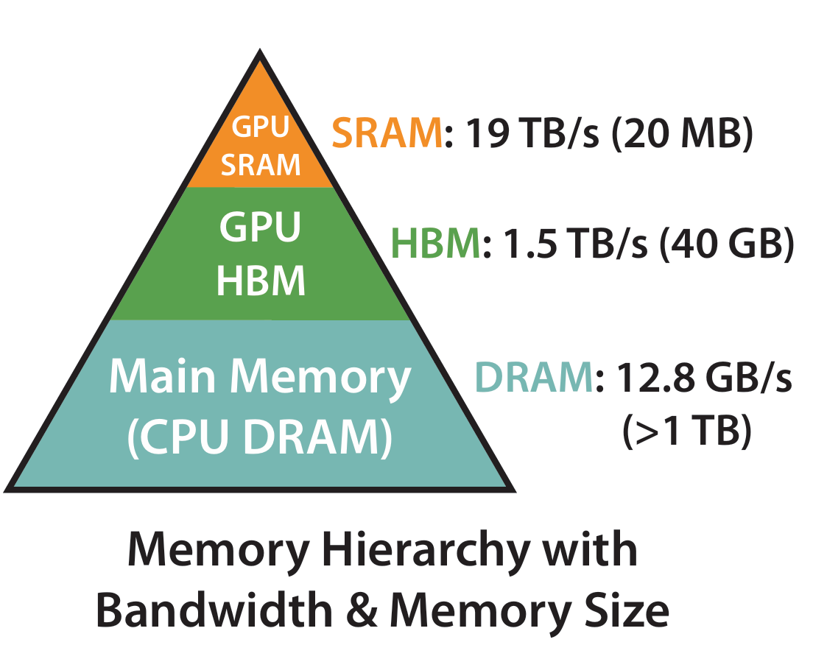
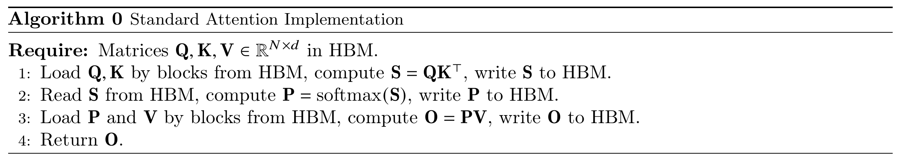

In the previous chapters, we already learned the basic computation process of self-attention. Given $Q, K, V$, the computation of attention (ignoring scaling) is usually written as:

$$
S = QK^\top, \quad P = \operatorname{softmax}(S), \quad O = PV
$$

From this formula, attention does not seem very special. In essence, it is just two matrix multiplications with a softmax in between. Since matrix multiplication is exactly the operation GPUs are best at, a very natural intuition is: attention should mainly be limited by compute. That is, the stronger the GPU's floating-point capability is, the faster attention should run.

But the real situation is exactly not like this.

In fact, standard attention is often not compute-bound, but IO-bound. In other words, it is slow not because it "cannot compute fast enough," but because it "cannot move data fast enough." The GPU is not spending its time on multiplication and addition, but on moving data from HBM to on-chip cache, and then moving it back from on-chip cache to HBM.

This conclusion sounds a bit counterintuitive the first time you hear it. After all, $QK^\top$ and $PV$ are both large matrix multiplications, so why is the bottleneck not computation, but data access?

The answer is hidden in attention's score matrix $S$ and probability matrix $P$. Their size is $N \times N$. If the sequence length is $N$, then the size of these two matrices grows with $N^2$. These two intermediate results are too large and usually cannot stay in on-chip SRAM for long, so they can only be written back to HBM frequently, and then read back from HBM to continue participating in later computation. What really slows attention down is exactly this large-scale data movement back and forth.

So, from the perspective of hardware execution, why is attention naturally an operator with heavy IO?

To answer this question, we need to start from a more low-level perspective, break down the actual execution process of attention on hardware, and see where it is really spending its time.

## 10.1.1 First Build a Hardware Perspective: What Exactly Can Limit an Operator?

Before analyzing attention, let us first think about a most basic question: why can a GPU operator be slow?

From a hardware perspective, there are usually only two possibilities:

1. Not enough compute: there are too many floating-point operations, so the GPU's compute units get saturated first.
2. Not enough bandwidth: there is too much data movement, so memory bandwidth gets saturated first.

If the bottleneck of an operator is computation, we call it compute-bound; if the bottleneck is memory access, we call it memory-bound or IO-bound. Here, IO does not mean disk read/write, but data movement in a broader sense. For GPUs, one of the most important kinds of IO is the data movement between SRAM and HBM.

So, when we say an operator is IO-bound, what we really mean is that it spends too much time on "moving data" rather than "computing on data."

### 10.1.1.1 Arithmetic Intensity: The Core Metric for Judging the Performance Bottleneck

Then how do we judge whether an operator is more like compute-bound or more like IO-bound?

In high-performance computing, there is a very core metric, which is **Arithmetic Intensity**:

$$
\mathrm{Arithmetic Intensity} = \frac{\mathrm{FLOPs}}{\mathrm{Bytes Moved}}
$$

That is, for every 1 byte of data moved, how many floating-point operations can be done. This metric directly determines whether the operator is closer to compute-bound or IO-bound.

Intuitively, it can be understood like this:

- If an operator reads a bit of data and then computes on it many times repeatedly, then its arithmetic intensity is high, and it is more likely to be compute-bound;
- If an operator reads a bit of data, does only a few operations, and then discards it, then its arithmetic intensity is low, and it is more likely to be IO-bound.

So, when judging the performance bottleneck of an operator, a very important question is: how many times is the data we read in actually reused?

### 10.1.1.2 Matrix Multiplication: A Classic Example of Being Compute-Bound

Take a simple example. Why is matrix multiplication usually compute-bound?

Suppose we have the following matrix multiplication:

$$
C = AB
$$

where $A$ is an $M \times K$ matrix, $B$ is a $K \times N$ matrix, and the result $C$ is an $M \times N$ matrix.

Although matrix multiplication has a large amount of computation, it has a very good property: input elements are reused repeatedly. For example, each element of matrix $A$ will be used to compute an entire row of $C$, and each element of matrix $B$ will be used to compute an entire column of $C$. Suppose the sizes of matrices $A$ and $B$ are both $N \times N$, then each element is reused about $N$ times. Therefore, the arithmetic intensity of matrix multiplication is about $O(N)$, so it is usually compute-bound.

This is also why GPUs are extremely good at GEMM (general matrix multiplication). It is not because matrix multiplication is inherently simple, but because it is very suitable for blocking, caching, and data reuse.

### 10.1.1.3 GPU Memory Is Not Flat, but Hierarchical

To understand the IO problem of attention, we also need to know that GPU storage is not unified. In terms of speed and capacity, GPU memory is hierarchical, and can be roughly understood as:

<figure class="figure" style="text-align: center;">
  
  <figcaption>Figure 1: GPU memory hierarchy model [@dao2022FlashAttentionv1, fig. 1]</figcaption>
</figure>

- Register: extremely small capacity, but the fastest, with almost zero access latency
- SRAM / Shared Memory / L2 Cache: small capacity, but fast, with low access latency, with speed about 19 TB/s
- HBM (High Bandwidth Memory): large capacity, but high access latency, with speed about 1.5 TB/s

So, for a high-performance operator, one core principle is: keep data on-chip as much as possible, and reduce access to HBM. Because although HBM is also very fast, compared with on-chip SRAM and registers, it is still much slower. More importantly, HBM bandwidth is a scarce resource shared by many thread blocks across the whole GPU. Once an operator needs to frequently write large tensors back to HBM and then read them back again, it is very easy for it to get bottlenecked by bandwidth.

At the same time, we also need to consider one point: the growth speed of GPU compute capability is far faster than the growth speed of memory bandwidth. This phenomenon is called the **Memory Wall**. That is, although the FLOPs numbers of modern GPUs are very astonishing, the improvement in memory bandwidth is relatively slow. If an operator cannot effectively reuse data, but instead frequently reads and writes large tensor blocks from HBM, then even if the arithmetic itself is not complicated, it can very likely become a performance bottleneck.

Next, we will really apply this perspective to attention.

## 10.1.2 Where Does Standard Attention Actually Spend Its Time?

Let us first look only at the most basic single-head attention, ignore the batch dimension, and also ignore the scaling factor for now. The computation process is:

$$
S = QK^\top, \quad P = \operatorname{softmax}(S), \quad O = PV
$$

where $Q, K, V \in \mathbb{R}^{N\times d}$, $S, P \in \mathbb{R}^{N\times N}$, and $O \in \mathbb{R}^{N\times d}$; $N$ is the sequence length, and $d$ is the feature dimension.

Now let us separately look at two things:

1. How much computation is needed?
2. How much data needs to be moved?

### 10.1.2.1 First Look at FLOPs: The Amount of Computation in Attention Is Not Small

- First step, compute $QK^\top$. This is a matrix multiplication of $(N\times d)\cdot(d\times N)$, and the output is $N\times N$. Its FLOPs scale is about $2N^2d$, where the 2 comes from multiply-add operations, which are usually counted as 2 FLOPs.
- Second step, compute softmax. Doing softmax on each row of $S$ requires subtracting the maximum, exponentiation, summation, normalization, and so on. Each element roughly needs one exponential and one division, so its FLOPs scale is about $2N^2$.
- Third step, compute $PV$. This is a matrix multiplication of $(N\times N)\cdot(N\times d)$, and its FLOPs scale is also $2N^2d$.

Therefore, the total FLOPs of standard attention is approximately:

$$
\mathrm{FLOPs} \approx 2N^2d + 2N^2 + 2N^2d = 4N^2d + 2N^2 \approx O(N^2d)
$$

So, from the perspective of computation amount, attention is indeed not cheap. The question is: a large amount of computation does not necessarily mean it is compute-bound. We also need to see what kind of data access pattern these computations are built on.

### 10.1.2.2 Then Look at IO: The Real Trouble Lies in the $N \times N$ Intermediate Matrices

Let us write the execution process of standard attention more accurately:

<figure class="figure" style="text-align: center;">
  
  <figcaption>Algorithm 1: Execution flow of standard attention [@dao2022FlashAttentionv1, alg. 0]</figcaption>
</figure>

Assume we use `float32`, and each element takes 4 bytes. We make a very rough estimate and only keep the dominant terms.

- Read $Q, K, V$: each is an $N\times d$ matrix, so in total we need to read in $12Nd$ bytes.
- Read and write back $S$ once: $S$ is an $N\times N$ matrix, so reading and writing it once takes $8N^2$ bytes.
- Read and write back $P$ once: $P$ is also an $N\times N$ matrix, so reading and writing it once also takes $8N^2$ bytes.
- Write back output $O$: $O$ is an $N\times d$ matrix, so writing it back takes $4Nd$ bytes.

Therefore, the total IO amount is approximately:

$$
\mathrm{IO} \approx 12Nd + 8N^2 + 8N^2 + 4Nd = 16N^2 + 16Nd \approx O(N^2 + Nd)
$$

When $N \gg d$, the IO scale is mainly dominated by the $N^2$ term. This shows that the heaviest IO cost of attention is not the input and output themselves, but the repeated read and write of the two $N\times N$ intermediate matrices.

### 10.1.2.3 Arithmetic Intensity: Long Sequences Do Not Make Attention More Compute-Bound

Now let us put FLOPs and IO together. We estimated earlier that the FLOPs of standard attention is about $O(N^2d)$, and IO is about $O(N^2 + Nd)$. Therefore, the arithmetic intensity of attention is about:

$$
\mathrm{Arithmetic Intensity} = \frac{O(N^2d)}{O(N^2 + Nd)} =
O\left(\frac{d}{1 + \frac{d}{N}}\right)
$$

When the sequence length is large enough, this can be approximated as $O(d)$. This means that, for large sequence lengths, the arithmetic intensity of attention is mainly determined by the feature dimension $d$, and does not depend much on the sequence length $N$.

This is a very critical point.

For many operators, as the problem size gets larger, data reuse also becomes more sufficient, so they become closer to compute-bound. But standard attention is not like this. Even if you make the sequence longer, its amount of computation becomes larger, but IO also becomes larger, and the arithmetic intensity does not improve much. On the contrary, in many cases, long sequences only make the IO problem more serious.

### 10.1.2.4 Why Is This Especially Bad?

Because these two intermediate matrices are too large. If $N=4096$, then a $4096\times 4096$ matrix has 16M elements, which is 64MB in `float32`. That is, just one $S$ is already tens of MB. Add $P$, then consider multi-head, batch, and more intermediate states in backpropagation, and the memory pressure becomes very exaggerated. This is also why long sequences amplify the IO problem of attention.

This is not just a matter of "taking up space." More importantly, these large matrices also have to be moved repeatedly. They are too large to stay in on-chip SRAM all the time, so every later operation has to read them back again from HBM. This makes attention exhibit a very undesirable pattern:

- A large amount of intermediate results are explicitly written back;
- These intermediate results have to be read out again very soon;
- But their reuse pattern is not well localized on-chip the way GEMM is.

So, from the hardware point of view, this is a very typical operator with heavy IO pressure.

## 10.1.3 Summary

In this chapter, we did not change the mathematical form of attention. Instead, we switched to another perspective and re-examined attention from the viewpoint of GPU execution and data movement.

We obtained three key conclusions:

1. Although standard attention contains two large matrix multiplications, its bottleneck is often not compute, but IO.
2. The root of the problem is that it explicitly constructs and stores two $N\times N$ intermediate matrices: the attention score matrix $S$ and the probability matrix $P$ after softmax. These matrices are large, which leads to repeated read and write to HBM.
3. As the sequence length increases, the $N^2$-level intermediate states and IO grow rapidly, so long sequences further magnify this problem.

And once we truly understand this point, one question appears: since the most expensive thing is the read and write of intermediate matrices, can we avoid storing them completely?

This is exactly the starting point of FlashAttention v1. In the next section, we will see that it does not approximate attention, but instead makes the execution process of attention access HBM as little as possible through better blocking and better IO organization.
