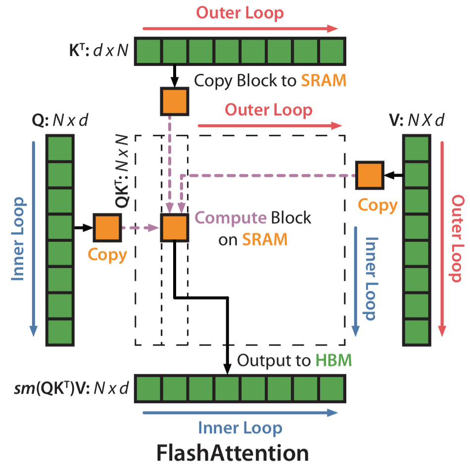
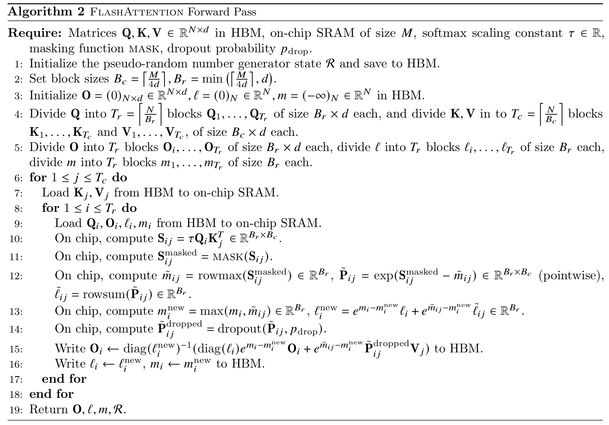
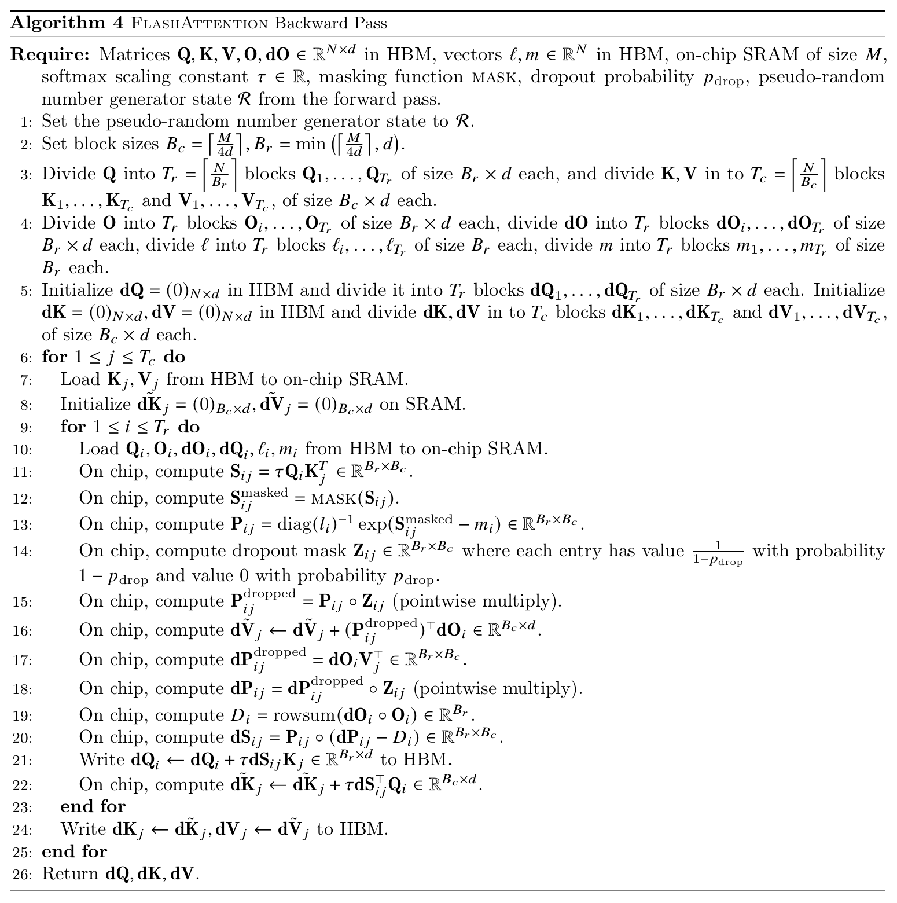

In 10.1, we already saw that the real bottleneck of standard attention is not compute, but IO. It is slow not because the two matrix multiplications themselves are too hard, but because the two large intermediate matrices $S$ and $P$ both need to be explicitly written back to HBM, and then read out again in later stages for computation. For long sequences, these two $N\times N$ intermediate matrices create enormous bandwidth pressure.

Since this is where the problem comes from, a very natural idea is: can we avoid storing $S$ and $P$ in HBM?

This is exactly the starting point of flash attention v1 [@dao2022FlashAttentionv1]. It does not change the mathematical result of attention, nor does it replace standard attention with an approximate algorithm. Instead, it uses an execution strategy that is better suited to GPUs: it fuses the steps of computing scores, doing softmax, and multiplying by $V$ together, completes them block by block on-chip, and only writes the final output $O$ back to HBM.

If we summarize the core idea of flash attention v1 in one sentence, it is:

> **Do not store the entire attention matrix; instead, scan, normalize, and accumulate the output on the fly.**

But this immediately brings up a new difficulty. In principle, we need to know an entire row before we can compute softmax. If we only get a small block of scores, how do we know the corresponding softmax weights for this block? And how can we guarantee that the final result is exactly the same as computing softmax over the full row at once?

This is precisely the key of flash attention v1. It uses the idea of online softmax, so that even if we scan the score matrix block by block, we can still correctly and stably maintain the normalization statistics required by softmax, and finally obtain exactly the same output as standard attention.

```{python}
import math

import dnnl.nn.functional as dF
import torch
import torch.nn.functional as F

print('PyTorch version:', torch.__version__)
```

## 10.2.1 From Standard Attention to Online Softmax

Let us first go back to the most ordinary single-head attention. Ignore the batch dimension and head dimension, and also omit the scaling factor for now. The computation can be written as:

$$
S = QK^\top, \quad P = \mathrm{softmax}(S), \quad O = PV
$$

Their shapes are:

$$
Q, K, V \in \mathbb{R}^{N \times d},
\quad S, P \in \mathbb{R}^{N \times N},
\quad O \in \mathbb{R}^{N \times d}
$$

For the $i$-th query, the corresponding output vector can be written as:

$$
O_i = \sum_{j=1}^N P_{ij} V_j, \quad P_{ij} = \frac{\exp(S_{ij})}{\sum_{k=1}^N \exp(S_{ik})}
$$

For numerical stability, softmax is usually not computed directly from the formula above. Instead, we first subtract the maximum value of that row. In other words, what we actually use is:

$$
P_{ij} = \frac{\exp(S_{ij} - m_i)}{\sum_{k=1}^N \exp(S_{ik} - m_i)}, \quad m_i = \max_j S_{ij}
$$

The advantage of writing it this way is that the numbers inside the exponential do not become too large, thus avoiding numerical overflow.

However, this also reveals exactly what makes softmax troublesome: to compute the softmax of one row, it seems that we must first know the maximum value $m_i$ of the whole row, as well as the normalization denominator of the whole row,

$$
l_i = \sum_{k=1}^N \exp(S_{ik} - m_i)
$$

This means that softmax does not seem as easy to tile as matrix multiplication. Matrix multiplication can be accumulated block by block because addition itself is naturally associative; but the normalization denominator of softmax depends on the whole row, and the row maximum may keep changing during scanning.

In other words, even if we compute $QK^\top$ block by block, we still cannot immediately accumulate it as simply as GEMM, because:

- the local maximum inside the current block may not be the maximum of the whole row;
- the exponential sum of the current block also depends on the choice of maximum;
- the output that has already been accumulated earlier may also need to be rescaled according to the new maximum.

This is the root reason why standard attention cannot directly perform “compute while normalizing.”

But from another angle, what do we really need to keep?

For the softmax of one row, if we only care about the final output $O_i$, we do not necessarily have to store the whole row $P_i$ and the whole row $S_i$. What we really need to maintain may just be some much smaller statistics. For example, the current maximum value, the current accumulated exponential sum, and the current accumulated output vector. If these quantities can be updated correctly during scanning, then we do not need to store the full attention matrix.

This is the core idea of online softmax. While scanning one row of scores block by block, we dynamically maintain the statistics required by softmax, and continuously rescale them as the maximum changes.

## 10.2.2 Rescaling in Online Softmax

To explain this, let us first look at softmax from the perspective of a single row.

Suppose that instead of seeing the whole row of scores at once, we split this row into two parts. The maximum value and normalized sum of the first part are:

$$
m^{(1)} = \max_{j \in \text{block 1}} s_j, \quad l^{(1)} =
\sum_{j \in \text{block 1}} \exp(s_j - m^{(1)})
$$

The maximum value and normalized sum of the second part are:

$$
m^{(2)} = \max_{j \in \text{block 2}} s_j, \quad l^{(2)} =
\sum_{j \in \text{block 2}} \exp(s_j - m^{(2)})
$$

Then, after combining the two parts, the maximum value of the whole row should be:

$$
m = \max(m^{(1)}, m^{(2)})
$$

The problem is that $l^{(1)}$ of the first part is computed under the scale of $m^{(1)}$, while $l^{(2)}$ of the second part is computed under the scale of $m^{(2)}$. To add them together, we must move them onto the same scale.

So we have:

$$
l = e^{m^{(1)} - m} l^{(1)} + e^{m^{(2)} - m} l^{(2)}
$$

This is the most crucial step in online softmax: whenever the current maximum changes, all previously accumulated quantities must be rescaled according to the new maximum.

By the same logic, not only the denominator of softmax needs to be rescaled, but the accumulated output vector also needs to be rescaled.

Because the output of attention is essentially a weighted sum:

$$
O_i = \sum_j P_{ij} V_j
$$

If we denote the unnormalized weights in some block by

$$
\tilde{P}_{ij} = \exp(S_{ij} - \tilde{m}_{ij})
$$

then the “unnormalized output” contributed by this block is

$$
\tilde{O}_i = \tilde{P}_{ij} V_j
$$

But it is also defined under the scale of the local maximum $\tilde{m}_{ij}$, so it must also be rescaled when merging.

Now let us put this idea back into the tiled setting of flash attention v1.

Suppose $Q$ is split into several row blocks, each of size $B_r \times d$; $K$ and $V$ are split into several column blocks, each of size $B_c \times d$. For the $i$-th query block and the $j$-th key/value block, we first compute the local scores:

$$
S_{ij} = Q_i K_j^\top
$$

Then, inside this small block, we compute the local maximum of each row:

$$
\tilde{m}_{ij} = \mathrm{rowmax}(S_{ij})
$$

and the corresponding local exponential sum:

$$
P_{ij} = \exp(S_{ij} - \tilde{m}_{ij}), \quad \tilde{l}_{ij} = \mathrm{rowsum}(P_{ij})
$$

Suppose that before processing this block, we have already maintained three quantities for the current query block:

- $m_i$: the global maximum of each row seen so far
- $l_i$: the normalized sum of each row seen so far
- $O_i$: the accumulated output of each row seen so far

Then after processing the new block, the new maximum should be:

$$
m_i' = \max(m_i, \tilde{m}_{ij})
$$

To bring the old statistics and the new statistics onto the same scale, we define two scaling factors:

$$
\alpha = \exp(m_i - m_i'), \quad \beta = \exp(\tilde{m}_{ij} - m_i')
$$

Then the new normalized sum can be updated as:

$$
l_i' = \alpha l_i + \beta \tilde{l}_{ij}
$$

And the new accumulated output can be updated as:

$$
O_i' = \frac{\alpha l_i O_i + \beta P_{ij} V_j}{l_i'}
$$

This formula may look a bit confusing at first, but the logic behind it is actually simple:

- the old output $O_i$ was computed under the old scale, so it must be multiplied by $\alpha l_i$ to be rescaled to the new scale;
- the output $P_{ij} V_j$ of the new block was computed under the current block’s own scale, so it must be multiplied by $\beta$ to be rescaled to the new scale;
- after adding the two parts together, we divide by the new normalized sum $l_i'$ to obtain the correct output under the unified scale.

So what flash attention v1 really maintains is not the full block of $S$ or $P$, but only:

- one maximum value $m_i$ for each row;
- one normalized sum $l_i$ for each row;
- one output vector $O_i$ for each row.

These quantities (except for $O$) are much smaller than the $N\times N$ attention matrix, so they can be kept entirely on-chip, thus avoiding writing intermediate matrices back to HBM.

## 10.2.3 Forward Pass Implementation of Flash Attention v1: Streaming Scan with Online Softmax

With online softmax, the forward pass of flash attention v1 becomes very natural.

The overall idea is:

1. split $Q$ into row blocks, and split $K$ and $V$ into column blocks;
2. fix one $Q_i$ block and scan all $K_j, V_j$ blocks in sequence;
3. for each block, compute the local scores $S_{ij} = Q_i K_j^\top$;
4. perform local softmax inside the block, and update $m_i, l_i, O_i$ using the online softmax formulas;
5. after all $K, V$ blocks have been scanned, obtain the final output corresponding to this $Q_i$ block;
6. repeat this process until all query blocks have been processed.

<figure class="figure" style="text-align: center;">
  
  <figcaption>Figure 1: Flash Attention v1 forward pass flow [@dao2022FlashAttentionv1, fig. 1]</figcaption>
</figure>

The biggest difference between this process and standard attention is that standard attention is “first obtain the full $S$, then obtain the full $P$, and finally obtain $O$”; while flash attention v1 is “scan one block, update the statistics once, and at the same time accumulate part of the output.” In other words, it no longer treats softmax as a separate stage that must be completed on the whole matrix, but instead integrates softmax into the tiled scanning process.

This has two benefits. First, the intermediate matrices do not need to be written to HBM. $S$ and $P$ only exist briefly on-chip during the computation of the current block, and can be discarded immediately after computation, without being written back to memory as full tensors. Second, the HBM access pattern becomes closer to a streaming scan. After each $K_j, V_j$ block is loaded on-chip, it immediately participates in score computation, softmax update, and output accumulation, rather than first producing a bunch of intermediate results to be handled in the next stage. This improves data reuse and reduces unnecessary reads and writes. Moreover, in terms of the final result, the forward pass of flash attention v1 still computes the exact standard attention, not approximate attention. What it changes is the execution strategy, not the mathematical definition.

<figure class="figure" style="text-align: center;">
  
  <figcaption>Algorithm 1: Pseudocode of the Flash Attention v1 forward pass [@dao2022FlashAttentionv1, alg. 2]</figcaption>
</figure>

Next, let us implement it in PyTorch.

```{python}
batch_size = 4
seq_len = 128
d_model = 64
Br, Bc = 32, 32
query = torch.randn(batch_size, seq_len, d_model)
key = torch.randn(batch_size, seq_len, d_model)
value = torch.randn(batch_size, seq_len, d_model)

# reference output
O_ref = F.scaled_dot_product_attention(query, key, value)
O_flash = dF.flash_attention_v1_forward(query, key, value, Br, Bc)

max_err = (O_flash - O_ref).abs().max()
print('Max absolute error:', max_err.item())
```

By comparing the output of our simulated implementation with that of standard attention, we can verify that the forward pass of flash attention v1 indeed produces exactly the same result. Although its execution pattern looks very different from standard attention, they are mathematically equivalent. Flash attention v1 simply uses a way of computing the same thing that is more suitable for GPU execution, thereby avoiding a large amount of IO and achieving acceleration.

## 10.2.4 Backward Pass of Flash Attention v1: Save Less in Forward, Recompute in Backward

At this point, the forward problem has already been solved: we can compute the output without storing $S$ and $P$, relying only on $m$, $l$, and $O$. But a new question immediately appears: what about the backward pass?

In standard attention, the backward pass usually directly uses intermediate results saved during the forward stage, such as $S$ and $P$. Since the gradient formulas often depend on these quantities, one of the most direct implementations is to save them during the forward pass and then read them back in the backward pass. But flash attention v1 intentionally does not save these $N\times N$ intermediate matrices in the forward pass. As a result, although the backward pass saves memory and IO, it loses the readily available intermediate results.

The solution of flash attention v1 is also simple and straightforward: just compute them again. This is the so-called **Recomputation**.

For standard attention,

$$
S = QK^\top, \quad P = \mathrm{softmax}(S), \quad O = PV
$$

Let the output gradient be $dO = \frac{\partial L}{\partial O}$, then the backward pass can still be written as:

$$
dV = P^\top dO, \quad dP = dO V^\top
$$

Then after applying the backward pass of softmax, we obtain $dS$, and finally propagate back to $Q$ and $K$:

$$
dS = dP \odot P - \mathrm{rowsum}(dP \odot P)
$$
$$
dQ = dS\,K, \quad dK = dS^\top Q
$$

So mathematically, the backward pass of flash attention v1 is the same as that of standard attention. The only real difference is this: these intermediate quantities are no longer stored in advance, but are recomputed during the backward pass.

Recall that we mentioned earlier that the forward stage of flash attention v1 does not save the full $S$ and $P$, but only saves the per-row maximum $m$, the per-row normalized sum $l$, and the final output $O$. When we reach the backward pass, we only need to rescan $Q$, $K$, and $V$ in a block order similar to the forward pass, recompute $S$ and $P$, and then use them to compute gradients.

For some block $Q_i$ and $K_j, V_j$, in the backward pass we can first recompute the local scores:

$$
S_{ij} = Q_i K_j^\top
$$

Then we use the $m_i$ and $l_i$ saved in the forward pass to recover the corresponding probability block:

$$
P_{ij} = \frac{\exp(S_{ij} - m_i)}{l_i}
$$

That is, the $P_{ij}$ needed by the backward pass is not read from HBM, but recomputed on the spot.

In implementation, the most critical formula for softmax backward is the following:

$$
dS_{ij} = P_{ij} \odot (dP_{ij} - \delta_i), \quad \delta_i = dO_i^\top O_i
$$

This formula shows that as long as we can recompute the current block’s $P_{ij}$, together with one scalar $\delta_i$ for each row, we can recover the gradient of softmax, without having to save the full $P$ during the forward pass. This is exactly the key that allows flash attention v1 to make the backward pass blockwise as well.

<figure class="figure" style="text-align: center;">
  
  <figcaption>Algorithm 2: Pseudocode of the Flash Attention v1 backward pass [@dao2022FlashAttentionv1, alg. 4]</figcaption>
</figure>

On the surface, recomputing $S_{ij}$ and $P_{ij}$ during the backward pass seems to add extra computation; but from a systems perspective, this is usually worthwhile. Compared with “save in forward, read back in backward,” recomputation does more FLOPs, but saves a large amount of HBM accesses. And as we already saw in 10.1, the bottleneck of attention is often not computation, but IO. So the strategy of flash attention v1 is still fundamentally the same idea: use more on-chip computation in exchange for less memory traffic.

Next, let us also implement the backward pass of flash attention v1 in PyTorch.

```{python}
batch_size = 4
seq_len = 128
d_model = 64
Br, Bc = 32, 32
query = torch.randn(batch_size, seq_len, d_model, requires_grad=True)
key = torch.randn(batch_size, seq_len, d_model, requires_grad=True)
value = torch.randn(batch_size, seq_len, d_model, requires_grad=True)

# reference forward
O_ref = F.scaled_dot_product_attention(query, key, value)
dO = torch.randn_like(O_ref)
O_ref.backward(dO)

dQ_ref = query.grad.detach().clone()
dK_ref = key.grad.detach().clone()
dV_ref = value.grad.detach().clone()

query = query.detach().clone()
key = key.detach().clone()
value = value.detach().clone()

# custom backward
dQ, dK, dV = dF.flash_attention_v1_backward(query, key, value, dO, Br, Bc)

max_err_dQ = (dQ - dQ_ref).abs().max()
max_err_dK = (dK - dK_ref).abs().max()
max_err_dV = (dV - dV_ref).abs().max()

print('dQ max absolute error:', max_err_dQ.item())
print('dK max absolute error:', max_err_dK.item())
print('dV max absolute error:', max_err_dV.item())
```

## 10.2.5 Limitations of Flash Attention v1: Why Do We Need Flash Attention v2?

At this point, flash attention v1 has already accomplished something very important: through tiled computation and online softmax, it avoids explicitly storing the full attention matrices $S$ and $P$, thereby significantly reducing HBM reads and writes. This is also the fundamental reason why it can be clearly faster than standard attention.

But this does not mean that flash attention v1 has already reached the optimum. More precisely, FA1 solves the big problem of “do not write the full $N\times N$ intermediate matrix back to HBM,” but there is still room for further optimization in how the kernel is organized. One key issue lies in the **loop order**.

In the forward pass of flash attention v1, it is common to place the blocks of $K, V$ in the outer loop and the blocks of $Q$ in the inner loop. In other words, the computation is closer to the following structure:

```{.python filename="FA1 pseudo code"}
for j in KV blocks:
    for i in Q blocks:
        update O_i, m_i, l_i
```

This arrangement has one direct benefit: each time a $K_j, V_j$ block is loaded from HBM onto the chip, it can be reused by as many $Q_i$ blocks as possible, thereby reducing repeated reads of $K$ and $V$. But the cost is also obvious: for a given $Q_i$ block, its output $O_i$ cannot be finalized after one inner-loop computation, because it still needs to interact with many different $K_j, V_j$ blocks later. Therefore, $O_i$ can only be updated continuously:

$$
O_i^{(1)} \to O_i^{(2)} \to \cdots \to O_i^{(T)}
$$

This means that FA1 often has to keep the intermediate $O_i$ together with the rowwise statistics $m_i, l_i$, so that they can continue to be updated when scanning new $K, V$ blocks later. In other words, although FA1 no longer stores the full $S$ and $P$, it still needs to save and repeatedly read and write part of the output state. From the perspective of IO, this is of course already much better than saving the $N\times N$ attention matrix, but it is still not the most ideal organization.

The core tension here is:

- when $K, V$ are placed in the outer loop, one $K_j, V_j$ block is shared by many $Q_i$ blocks;
- but in return, the output $O_i$ of each $Q_i$ block can only be accumulated little by little, rather than completed all at once.

As a result, the algorithm has to preserve intermediate states such as $O_i$, $m_i$, and $l_i$ across multiple stages.

FlashAttention-2 continues to optimize exactly along this direction. One of its key changes is to rearrange the loop order and parallelization strategy. Instead of following FA1’s “$K, V$ outside, $Q$ inside” loop structure, it switches to a scheduling strategy that is more suitable for finishing each output block independently. Intuitively, this means letting one thread block work as much as possible around the same $Q_i$ block, and after scanning all the related $K, V$ blocks, produce the final $O_i$ in one shot, rather than storing and updating it repeatedly across multiple stages.
