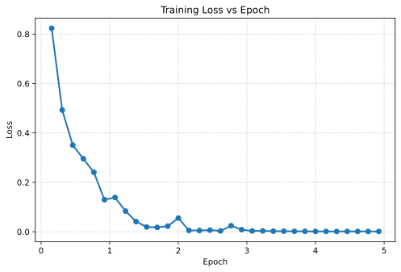

In the previous section, we connected a most basic Vision Transformer end to end:

$$
\begin{aligned}
\text{image}
& \rightarrow \text{patch embedding} \\
& \rightarrow \text{class token} \\
& \rightarrow \text{positional embedding} \\
& \rightarrow \text{Transformer Encoder} \\
& \rightarrow \text{classification head}
\end{aligned}
$$

If the goal is only image classification, it seems that we are done here. Feed in an image, let the model output class logits, and train it with cross entropy.

But in practical applications, the value of ViT is not limited to classification. A more common approach is to view ViT as a general-purpose **visual backbone**: it is responsible for encoding images into a group of high-level visual features, and then different task heads are attached afterward for classification, detection, segmentation, or even multimodal tasks.

This brings up a new question:

> **Why is ViT especially suitable as a backbone? If we treat it as a backbone, what are pretraining and fine-tuning doing respectively?**

In this section, we start from this question and discuss how ViT is used as a visual backbone.

```{python}
import math
from pprint import pprint

import dnnl
import evaluate
import IPython.display as ipy
import numpy as np
import torch
import torch.nn as nn
import torch.nn.functional as F
from datasets import load_dataset
from torch import Tensor
from transformers import Trainer, TrainingArguments

print('PyTorch version:', torch.__version__)
```

```{python}
dnnl.set_seed(42)
device = dnnl.get_default_device()
print('Using device:', device)
```

## 11.5.1 From Classification Model to Visual Backbone

Let us first return to the complete ViT classification model from the previous section. It can be split into two parts:

$$
\text{ViT} = \text{backbone} + \text{task head}
$$

where the backbone includes:

$$
\text{patch embedding}
+ \text{class token}
+ \text{positional embedding}
+ \text{Transformer Encoder}
$$

The task head is the final classification head:

$$
\operatorname{Linear}: \mathbb{R}^{D} \rightarrow \mathbb{R}^{K}
$$

For image classification, the classification head takes the output representation of the class token:

$$
h_\mathrm{cls} = Z_L[:, 0, :]
$$

and maps it to class logits:

$$
\mathrm{logits} = h_\mathrm{cls} W + b
$$

However, the truly general part is not this classification head, but the ViT Encoder in front of it. The classification head is only related to the classes of a specific dataset. For example, ImageNet has 1000 classes, CIFAR-10 has 10 classes, and a medical image dataset may have only 2 or 5 classes. Once the classes change, the final classification head needs to be replaced.

By contrast, what the ViT Encoder learns is a more general visual representation. It converts an image into a group of context-aware token representations:

$$
Z_L \in \mathbb{R}^{B \times (N+1) \times D}
$$

These token representations can be reused by different tasks. Therefore, we usually call the main part of ViT the backbone, and the small modules attached afterward for specific tasks the heads.

Intuitively:

> **The visual backbone is responsible for understanding the image, and the head is responsible for answering a specific question.**

## 11.5.2 What Does the Backbone Provide for Downstream Tasks?

Since the output of the ViT backbone is a token sequence, what exactly does it provide to downstream tasks?

Suppose that after the ViT Encoder, the output is:

$$
Z_L = [z_\mathrm{cls}, z_1, z_2, \dots, z_N]
$$

There are two types of representations here:

1. $z_\mathrm{cls}$: the output of the class token, usually viewed as the global representation of the whole image;
2. $z_1, z_2, \dots, z_N$: the outputs of patch tokens, which preserve local representations of different image regions.

If the task is image classification, we usually only need global semantics, so we can take the class token:

$$
h_\mathrm{image} = z_\mathrm{cls}
$$

If the task is semantic segmentation, we need to make predictions for each spatial position, so patch tokens become more important. This is because each patch token still corresponds to a region in the image. As long as we rearrange patch tokens back into a two-dimensional grid, we can obtain a representation similar to a feature map.

Suppose the image is cut into $H_p \times W_p$ patches. Then the number of patch tokens is:

$$
N = H_p \times W_p
$$

The shape of patch tokens is:

$$
(B, N, D)
$$

We can restore it into a two-dimensional feature map:

$$
(B, N, D)
\rightarrow
(B, H_p, W_p, D)
\rightarrow
(B, D, H_p, W_p)
$$

In this way, the output of the ViT backbone can be connected to various dense prediction modules for tasks such as semantic segmentation, instance segmentation, and object detection.

We can write a simple function to restore patch tokens into a feature map:

```{python}
def patch_tokens_to_feature_map(
    patch_tokens: Tensor,
    grid_size: tuple[int, int],
) -> Tensor:
    batch_size, num_patches, embed_dim = patch_tokens.size()
    grid_h, grid_w = grid_size

    if num_patches != grid_h * grid_w:
        raise AssertionError('`num_patches` must be equal to `grid_h * grid_w`.')

    x = patch_tokens.reshape(batch_size, grid_h, grid_w, embed_dim)
    x = x.permute(0, 3, 1, 2)
    return x
```

Test it:

```{python}
embed_dim = 64
grid_size = (4, 4)
num_patches = math.prod(grid_size)

patch_tokens = torch.randn(2, num_patches, embed_dim)
feature_map = patch_tokens_to_feature_map(patch_tokens, grid_size)

print('Patch tokens shape:', patch_tokens.shape)
print('Feature map shape:', feature_map.shape)
```

We can see that patch tokens change from `(B, N, D)` to `(B, D, H_p, W_p)`. This is a very common step when ViT is used as a dense prediction backbone.

## 11.5.3 Why Is ViT Suitable as a Backbone?

Now we can answer more concretely: why is ViT suitable as a backbone?

The first reason is that ViT has a very unified interface. Whether the input is an image, text, or another modality, as long as the input can be represented as a token sequence, it can be fed into Transformer. For images, patch embedding translates the image into visual tokens; for text, word embedding translates words into text tokens. In the end, they all become the unified token representation `(B, N, D)`, making it easy for ViT to connect with other Transformer modules.

The second reason is that ViT's output contains both global and local representations. The class token can be used for image-level tasks, while patch tokens can be used for position-related tasks. Therefore, the same backbone can serve different downstream tasks.

The third reason is that self-attention is well suited for modeling long-range relationships. In CNNs, information interaction between distant regions usually needs to propagate gradually through multiple convolution layers; in ViT, any two patches can interact directly in one self-attention layer. This makes ViT very natural for modeling global structure.

However, this also comes with a cost: standard ViT has relatively weak visual priors. CNNs naturally have locality and translation equivariance, while ViT relies more on data to learn visual structure by itself. Therefore, ViT often depends more on large-scale pretraining. In other words, ViT is suitable as a backbone not because it understands images better than CNNs from the beginning, but because it provides a very general, scalable, and transferable visual representation framework.

## 11.5.4 Pretraining: Learning General Visual Representations First

Previously, we understood the ViT backbone from a structural perspective. Of course, we cannot train a ViT backbone with a small dataset like CIFAR-10. Because ViT has a large number of parameters, training it requires a large amount of data to avoid overfitting. Therefore, in practical use, the more common approach is to directly load a checkpoint that others have already trained. This already trained model is usually called a **pretrained model**.

The so-called **pre-training** means letting the model see many, many images first, so that it can accumulate some general visual experience in advance.

For example, we can first let ViT learn to distinguish 1000 classes on ImageNet-1K, including animals, plants, furniture, food, tools, and many other common things. At this time, although the model has not yet seen our specific flower classification dataset, it has already learned many general visual cues, such as edges, textures, color combinations, object contours, and the relationship between foreground and background.

Based on this, we only need to continue training this ViT model for a short period on our own flower dataset so that it adapts to the new classes. Since the model already has a certain visual understanding ability, this process is usually much easier than training from scratch. This process is called **fine-tuning**.

Hugging Face Transformers provides many pretrained ViT checkpoints that we can load and use directly. To distinguish different configurations, these model names usually contain key information such as model scale, patch size, input image resolution, and pretraining dataset. For example:

```text
vit-base-patch16-224
```

We can understand it in three parts:

1. `base`: indicates model scale, usually with different sizes such as `tiny`, `small`, `base`, and `large`;
2. `patch16`: indicates that the patch size is $16 \times 16$, meaning each patch contains $16 \times 16$ pixels;
3. `224`: indicates that the input resolution during pretraining is $224 \times 224$.

That is, `vit-base-patch16-224` corresponds to a ViT-base model. The input image is usually resized to $224 \times 224$ and then cut into $16 \times 16$ patches.

Common ViT configurations can be organized as follows:

::: {.list-table}
Table 1: Common ViT model configurations

- - Model name
  - Patch Size
  - Input resolution
  - Embedding dimension
  - Transformer layers
  - Attention heads
  - Parameters
  - Characteristics

- - `google/vit-base-patch16-224`
  - 16
  - 224
  - 768
  - 12
  - 12
  - 86M
  - Most commonly used ViT-Base/16 configuration

- - `google/vit-base-patch32-224`
  - 32
  - 224
  - 768
  - 12
  - 12
  - 86M
  - Larger patches, fewer tokens, cheaper computation

- - `google/vit-large-patch16-224`
  - 16
  - 224
  - 1024
  - 24
  - 16
  - 307M
  - Larger ViT-Large configuration, better performance but heavier

- - `google/vit-large-patch32-384`
  - 32
  - 384
  - 1024
  - 24
  - 16
  - 307M
  - Larger input resolution, suitable for fine-grained tasks
:::

Here, `base` and `large` mainly control the width and depth of the Transformer Encoder:

- `base` usually uses `hidden_size=768`, `hidden_layers=12`, and `attention_heads=12`;
- `large` usually uses `hidden_size=1024`, `hidden_layers=24`, and `attention_heads=16`.

Meanwhile, `patch16` and `patch32` mainly affect the number of tokens. The smaller the patch, the more tokens there are and the more spatial detail is preserved, but the computational cost of self-attention also becomes larger. Since the complexity of self-attention is approximately quadratic in sequence length, under the same input resolution, `patch16` is finer than `patch32`, but also more expensive.

If we want to load a pretrained ViT for image classification, we can directly use the Hugging Face Transformers library:

```{python}
from transformers import AutoImageProcessor, AutoModelForImageClassification

model_id = 'google/vit-base-patch16-224'

processor = AutoImageProcessor.from_pretrained(model_id)
model = AutoModelForImageClassification.from_pretrained(model_id)
ipy.clear_output()

print('Image size:', model.config.image_size)
print('Patch size:', model.config.patch_size)
print('Hidden size:', model.config.hidden_size)
print('Number of hidden layers:', model.config.num_hidden_layers)
print('Number of attention heads:', model.config.num_attention_heads)
print('Intermediate size:', model.config.intermediate_size)
```

Here, `processor` is responsible for converting a PIL image or NumPy image into the `pixel_values` required by the model, including preprocessing such as image resizing and normalization; `model` is a ViT model with a classification head.

If we only care about backbone features, we can also load `ViTModel`, which does not include a specific classification head:

```{python}
from transformers import ViTModel

model_id = 'google/vit-base-patch16-224'

backbone = ViTModel.from_pretrained(model_id)
ipy.clear_output()
```

However, in downstream classification tasks, it is more common to first load `AutoModelForImageClassification`, and then replace the classification head with the number of classes needed by the current dataset. This is because `AutoModelForImageClassification` already wraps `ViTModel` and the classification head together, and directly outputs the `logits` needed for classification. If we use `ViTModel`, we still need to write a classification head ourselves to receive the output of the backbone.

## 11.5.5 Fine-tuning: Transferring the Backbone to a Specific Task

After pretraining is complete, whenever we encounter a new task, we usually do not train a ViT from scratch again. Instead, we directly take the pretrained backbone and perform **fine-tuning** for this specific task.

Suppose the number of classes during pretraining is 1000, and now we want to do a 10-class classification task. At this point, the backbone can be reused, but the classification head must be replaced:

$$
\operatorname{Linear}(D, 1000)
\quad \rightarrow \quad
\operatorname{Linear}(D, 10)
$$

Then we continue training on the new dataset:

$$
\text{image}
\rightarrow
\text{pretrained ViT backbone}
\rightarrow
\text{new task head}
$$

This is fine-tuning.

Depending on whether the backbone parameters are updated, fine-tuning usually has two approaches.

The first is **linear probing**. That is, freeze the backbone and train only the new classification head:

$$
\theta_\mathrm{backbone} \text{ fixed},
\quad
\theta_\mathrm{head} \text{ trainable}
$$

This method can test whether the representation learned by the backbone is already good enough. If training only a linear classification head can achieve good results, it means the backbone features have strong transferability. At the same time, because the backbone parameters are not updated, this training method is faster and less likely to overfit, making it suitable when downstream data is limited.

The second is **full fine-tuning**. That is, train the classification head and the backbone together:

$$
\theta_\mathrm{backbone}, \theta_\mathrm{head} \text{ trainable}
$$

This method usually performs better, because the backbone can adapt to the downstream task. But it is also more likely to overfit, especially when there is relatively little downstream data.

We use the Hugging Face `beans` dataset for a small experiment. This dataset is a bean leaf disease classification dataset with 3 classes in total. We first load a ViT pretrained on ImageNet, and then replace the classification head with a 3-class head. It is okay if you do not understand this code now; at the end of the chapter, we will specifically introduce how to fine-tune ViT and how to apply ViT to concrete downstream tasks.

::: {.callout-note}
The following code takes a relatively long time to run (about 10 minutes on XPU), so it will not run by default when rendering the document. If you want to run it yourself, you can change `eval: false` to `eval: true`, or directly copy the code into a Python file and run it.
:::

```{python}
#| eval: false
from transformers import AutoImageProcessor, AutoModelForImageClassification

model_id = 'google/vit-base-patch16-224'
ds = load_dataset('beans')
train_ds = ds['train'].shuffle()
val_ds = ds['validation'].shuffle()

labels = ds['train'].features['labels'].names
id2label = {i: label for i, label in enumerate(labels)}
label2id = {label: i for i, label in id2label.items()}

processor = AutoImageProcessor.from_pretrained(model_id)
model = AutoModelForImageClassification.from_pretrained(
    model_id,
    num_labels=len(labels),
    id2label=id2label,
    label2id=label2id,
    ignore_mismatched_sizes=True,
    device_map=device,
)
ipy.clear_output()


def transform(batch: dict) -> dict:
    images = [image.convert('RGB') for image in batch['image']]
    inputs = processor(images, return_tensors='pt')
    inputs['labels'] = batch['labels']
    return inputs


train_ds = train_ds.with_transform(transform)
val_ds = val_ds.with_transform(transform)


def collate_fn(images: list[dict]) -> dict:
    pixel_values = torch.stack([image['pixel_values'] for image in images])
    labels = torch.tensor([image['labels'] for image in images])
    return {'pixel_values': pixel_values, 'labels': labels}


def compute_metrics(eval_pred: tuple[np.ndarray, np.ndarray]) -> dict:
    acc_metric = evaluate.load('accuracy')
    logits, labels = eval_pred
    predictions = np.argmax(logits, axis=-1)
    acc_value = acc_metric.compute(predictions=predictions, references=labels)
    return acc_value


training_args = TrainingArguments(
    output_dir='vit-beans-demo',
    per_device_train_batch_size=16,
    per_device_eval_batch_size=16,
    num_train_epochs=5,
    learning_rate=2e-5,
    logging_steps=10,
    save_strategy='no',
    remove_unused_columns=False,
)
trainer = Trainer(
    model=model,
    args=training_args,
    train_dataset=train_ds,
    eval_dataset=val_ds,
    processing_class=processor,
    data_collator=collate_fn,
    compute_metrics=compute_metrics,
)

before_finetuning = trainer.evaluate()
trainer.train()
after_finetuning = trainer.evaluate()

print('Before fine-tuning:')
pprint(before_finetuning)
print('\n', end='')
print('After fine-tuning:')
pprint(after_finetuning)
```

```code
Before fine-tuning:
{'epoch': 0,
 'eval_accuracy': 0.40601503759398494,
 'eval_loss': 1.0192097425460815,
 'eval_model_preparation_time': 0.003,
 'eval_runtime': 8.7041,
 'eval_samples_per_second': 15.28,
 'eval_steps_per_second': 1.034}

After fine-tuning:
{'epoch': 5.0,
 'eval_accuracy': 0.9849624060150376,
 'eval_loss': 0.020609118044376373,
 'eval_model_preparation_time': 0.003,
 'eval_runtime': 4.5798,
 'eval_samples_per_second': 29.041,
 'eval_steps_per_second': 1.965}
```

<figure class="figure" style="text-align: center;">
  
</figure>

The key comparison in this example is to observe the change of the same pretrained ViT on a downstream dataset:

```text
Without fine-tuning: pretrained backbone + randomly initialized new classification head
After fine-tuning: pretrained backbone + new classification head already adapted to the beans dataset
```

We can see that as long as the data amount is sufficient and the training setup is reasonable, the accuracy after fine-tuning is usually significantly higher than the result without fine-tuning. Moreover, fine-tuning usually only needs a small number of training steps to achieve good results. The reason is also direct: the pretrained backbone already has strong visual understanding ability, and fine-tuning only further adapts the classification head and backbone to the classes of the current dataset.

## 11.5.6 Backbone Thinking: How Different Tasks Use ViT

Starting from this section, we can look at ViT in a more engineering-oriented way:

$$
\text{model} = \text{backbone} + \text{head}
$$

where the backbone is responsible for encoding images into general visual representations, and the head is responsible for solving the specific task.

This idea applies not only to ViT, but also to many vision models. For example, the ResNet backbone often mentioned in CNNs is similar: the convolutional network in front extracts general visual features, and the classification head, detection head, or segmentation head behind it completes the specific task.

What is special about ViT is that its backbone output is not a single feature map in the traditional CNN sense, but a group of token representations:

$$
Z = [z_\mathrm{cls}, z_1, z_2, \dots, z_N] \in \mathbb{R}^{B \times (N+1) \times D}
$$

where $z_\mathrm{cls}$ is usually used for image-level tasks, while patch tokens $z_1,\dots,z_N$ preserve finer-grained spatial information. Therefore, downstream tasks choose different ways of using tokens depending on what kind of output they need.

For image classification, the task needs an image-level representation, so the class token is usually used:

$$
z_\mathrm{cls} \rightarrow \text{classification head}
$$

For semantic segmentation, the task needs the class of each spatial position, so patch tokens are usually used. We can first remove the class token, then restore the patch tokens into a two-dimensional feature map and attach a segmentation head:

$$
[z_1, z_2, \dots, z_N]
\rightarrow
(B, D, H_p, W_p)
\rightarrow
\text{segmentation head}
$$

For object detection, the model needs to determine both “where the object is” and “what class the object belongs to.” In this case, the ViT backbone can provide patch-level features, and the detection head then predicts bounding boxes and classes based on these features.

For multimodal tasks, the image tokens output by ViT can be used as visual context and queried by text tokens; they can also be concatenated with text tokens and fed into a larger multimodal Transformer:

$$
\text{image tokens} + \text{text tokens}
\rightarrow
\text{multimodal Transformer}
$$

So, when we say “ViT is a backbone,” the focus is not the final classification head, but the token representation learning ability in front. ViT turns images into a group of reusable visual tokens, and the task heads afterward simply ask different questions over these tokens.

## 11.5.7 Chapter Summary

In this section, we started from the complete ViT classification model and further discussed how ViT is used as a visual backbone.

A complete ViT can be split into:

$$
\text{ViT} = \text{backbone} + \text{task head}
$$

where the backbone is responsible for encoding the image into token representations:

$$
(B, C, H, W) \rightarrow (B, N+1, D)
$$

These token representations have two common uses:

1. Use the class token to represent the whole image, for image-level tasks such as classification;
2. Use patch tokens to represent local regions, for position-related tasks such as segmentation and detection.

ViT is suitable as a backbone because it uses a unified token interface, can model global relationships, and its output token representations can be reused by different task heads. However, standard ViT has weaker visual priors, so it usually needs to be pretrained on large-scale data first, allowing the backbone to learn general visual representations, and then the task head is replaced and fine-tuned for downstream tasks.

At this point, we have finished the most basic ViT architecture and usage. However, as we said earlier, although ViT has a simple and unified structure, it lacks the strong visual priors of CNNs, so when the amount of data is insufficient, its training performance is often not as good as traditional convolutional networks.

A key observation in the original ViT paper is: when the model is pretrained on extremely large-scale datasets, such as JFT-300M (more than 200 times larger than ImageNet-1K), ViT can achieve very strong results; but if it is trained from scratch only on a dataset of the scale of ImageNet-1K (which is already very large), ViT's advantage is not obvious. In other words, ViT is powerful, but at the beginning it is more like a model that “eats data.”

This leads to another question:

> **If we do not have an extremely large private dataset such as JFT-300M, can we still train ViT well?**

DeiT, which will be introduced in the next section, was proposed to solve this problem. Its goal is not to change the basic structure of ViT, but to use more appropriate training strategies and knowledge distillation so that ViT can also be trained well on relatively standard data scales such as ImageNet-1K.
