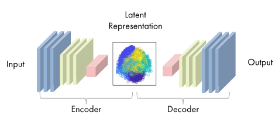
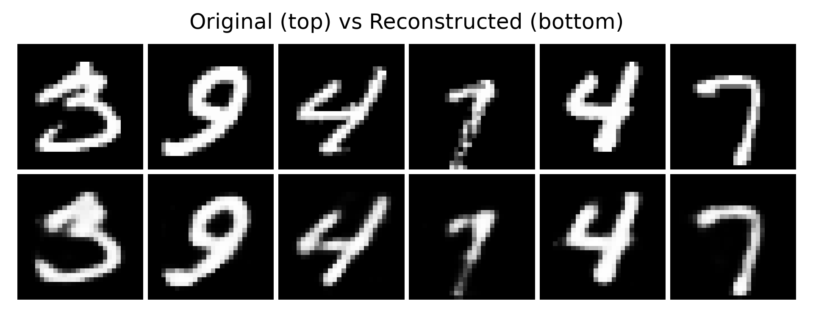
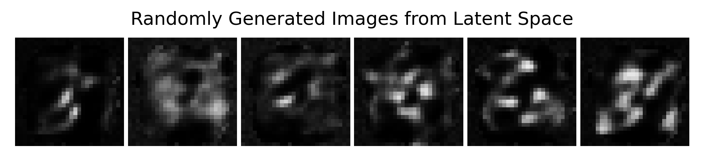
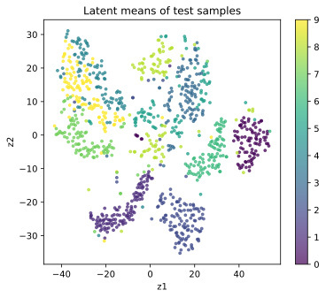

Before formally entering VAE (Variational Autoencoder), let us first look at a simpler and more intuitive model, which is also the predecessor of VAE: **AutoEncoder** [@hinton2006AutoEncoder].

If we summarize it in one sentence, what an AutoEncoder does is actually very simple:

> **Compress the input data into a more compact representation, and then recover the original input from this representation as much as possible.**

It sounds a bit like a data compressor. For example, an image may originally have hundreds or thousands of pixels, so its information dimension is very high. An AutoEncoder tries to compress it into a lower-dimensional vector, and then reconstruct the original image from this vector.

This process looks simple, but it is important. Because it tells us that neural networks can not only do classification, but can also learn an internal representation of the data itself. This is exactly the foundation for understanding VAE and Diffusion later, and even the latent space in diffusion models.

```{python}
import math

import matplotlib.pyplot as plt
import torch
import torch.nn as nn
import torch.optim as optim
import torch.utils.data as utils
import torchvision.datasets as datasets
import torchvision.transforms.v2 as v2
from sklearn.manifold import TSNE
from torch import Tensor
from torchmetrics import MeanMetric
from torchvision.utils import make_grid

plt.rc('savefig', dpi=300, bbox='tight')
print('PyTorch version:', torch.__version__)
```

```{python}
torch.manual_seed(42)
torch.use_deterministic_algorithms(False)
torch.backends.cudnn.deterministic = False
torch.backends.cudnn.benchmark = True

device = torch.accelerator.current_accelerator(check_available=True)
if device is None:
    device = torch.device('cpu')
print(f'Using device: {device}')
```

## 13.1.1 What Is an AutoEncoder

A standard AutoEncoder consists of two parts:

- **Encoder**: maps the input $x$ into a low-dimensional representation $z$;
- **Decoder**: maps this representation $z$ back into the reconstruction result $\hat{x}$.

Written as formulas:

$$ z = f_\theta(x) $$
$$ \hat{x} = g_\phi(z) $$

Combined together, it can also be written as:

$$ \hat{x} = g_\phi(f_\theta(x)) $$

Here, $x$ is the original input; $z$ is the intermediate **latent representation**; and $\hat{x}$ is the result reconstructed by the model.

Structurally, it looks like a U-shaped funnel. The first half continuously compresses the high-dimensional input. The middle passes through a smaller bottleneck layer. The second half then expands the information and restores it back to the original space. It feels a bit like U-Net, but its goal is not segmentation, but reconstruction.

The core structure of an AutoEncoder often looks like this:

$$ x \rightarrow \text{Encoder} \rightarrow z \rightarrow \text{Decoder} \rightarrow \hat{x} $$

<figure class="figure" style="text-align: center;">
  
  <figcaption>Figure 1: AutoEncoder Network Structure [@Mathworks2026AutoEncoder]</figcaption>
</figure>

At this point you may ask: if the goal is only to make the output as close as possible to the input, why does the model not simply learn an identity mapping?

Indeed, if there is no constraint, a network with enough capacity may simply copy the input exactly. In that case, even though the training error is small, the network has not learned anything valuable. So the key of AutoEncoder is not that the input equals the output, but that the model must pass through a constrained intermediate representation $z$ before it can finish reconstruction.

This is like asking one person to look at a complicated image and summarize it using only one short sentence, and then asking another person to draw the image back as much as possible based on that sentence. If the final drawing is still pretty good, it means this summary really captured the key information in the image.

Therefore, the essence of AutoEncoder is to force the model to learn an effective representation of the data during compression.

## 13.1.2 Training Objective: Make Reconstruction as Close as Possible to the Input

The training of an AutoEncoder is very intuitive: given an input $x$, after encoding and decoding we get $\hat{x}$, and then we make $\hat{x}$ as close as possible to $x$.

The most common loss function is **reconstruction loss**:

$$ \mathcal{L}(x, \hat{x}) = \|x - \hat{x}\|^2 $$

That is, mean squared error (MSE).

If the input is an image and the pixel values are between $[0,1]$, we can also use binary cross entropy (BCE):

$$ \mathcal{L}(x, \hat{x}) = - \sum_i \left[x_i \log \hat{x}_i + (1-x_i)\log(1-\hat{x}_i)\right] $$

No matter what the exact form is, the idea is the same: let the model learn to recover the original data from the compressed representation as much as possible.

So the optimization objective of AutoEncoder can be written as:

$$ \min_{\theta,\phi} \mathbb{E}_{x \sim p_{\text{data}}}[\mathcal{L}(x, \hat{x})] $$

There are no labels here, and no supervised signals like “cat” or “dog” are needed. The model only needs the data itself to train. Therefore, AutoEncoder is often regarded as a **self-supervised / unsupervised** representation learning method.

Take MNIST handwritten digits as an example. One image has size $28 \times 28$, with 784 pixels in total. We can design an AutoEncoder:

- Input layer: 784 dimensions
- Encoder: 784 → 256 → 64 → 16
- Decoder: 16 → 64 → 256 → 784
- Output layer: 784 dimensions

In this way, we keep only a 16-dimensional vector $z$ in the middle. This means that every digit image is compressed into a 16-dimensional point.

If the training works well, we will find that:

- Similar digits will be mapped to nearby positions
- Digits from different categories may form different regions in the latent space
- The Decoder can roughly reconstruct the corresponding digit shapes from these points

This shows that what the AutoEncoder learns is not how to store each pixel separately, but the higher-level structure behind the image, such as strokes, shapes, and the overall contour. This is also where the concept of latent space really appears for the first time. The model tries to represent the essential structure of data in a more compact space.

## 13.1.3 What Does an AutoEncoder Learn

What an AutoEncoder learns can be understood from two levels.

**First level: compressed representation**

An AutoEncoder turns the original high-dimensional data into a smaller vector. This vector is usually not a hand-designed feature, but something learned by the network itself. For example, for face images, the latent vector may implicitly contain pose, lighting, contour, expression, and local texture. These factors may not be individually interpretable, but together they form a certain encoding of the input.

**Second level: data structure**

To successfully reconstruct the input, the model must capture the statistical patterns in the data. So an AutoEncoder often learns which patterns frequently appear in the data, which features are important, and which details can be ignored. In other words, it is not merely memorizing samples, but to some extent learning what this kind of data usually looks like.

**The relationship between AutoEncoder and PCA**

From one perspective, AutoEncoder can be viewed as a nonlinear extension of PCA.

What PCA does is project the data into a low-dimensional linear subspace while preserving as much variance of the original data as possible. What an AutoEncoder does is use a neural network to learn encoding and decoding, so it can represent complex nonlinear mappings. If an AutoEncoder has only one linear encoder layer and one linear decoder layer, and uses MSE as the loss, then the subspace it learns has a close relationship with PCA.

But the advantage of neural networks is that real data is often not distributed on a linear subspace, but lies near some complex nonlinear subspace. In more professional terms, the data may be distributed on a complex **low-dimensional manifold**. Therefore, PCA has difficulty capturing this structure, while AutoEncoder, thanks to its flexible nonlinear mapping ability, can better adapt to the intrinsic geometry of the data.

So compared with PCA, AutoEncoder is more suitable for complex data such as images, speech, and text.

## 13.1.4 PyTorch Implementation of AutoEncoder

Next, let us look at the simplest AutoEncoder implementation. Here we use fully connected networks for encoding and decoding, which is suitable for understanding the basic process.

Here we define a basic `AutoEncoder` class, containing an encoder and a decoder. The encoder is a two-layer fully connected network. The input dimension is 784 (a flattened 28x28 image), and the output dimension is 32 (the size of the latent space). The decoder is also a two-layer fully connected network, restoring the latent vector from 32 dimensions back to 784 dimensions.

At the same time, because we use the transformation `v2.ToDtype(torch.float32, scale=True)`, the input pixel values will be normalized to the range $[0,1]$. So we add an `nn.Sigmoid()` activation function at the end of the decoder to make sure the output is also in the range $[0,1]$.

```{python}
class AutoEncoder(nn.Module):
    def __init__(
        self,
        input_shape: tuple[int, int, int],
        hidden_dim: int = 256,
        latent_dim: int = 32,
    ):
        super().__init__()
        self.input_shape = input_shape
        input_dim = math.prod(input_shape)
        self.latent_dim = latent_dim
        self.encoder = nn.Sequential(
            nn.Flatten(),  # 28x28 -> 784
            nn.Linear(input_dim, hidden_dim),
            nn.ReLU(),
            nn.Linear(hidden_dim, latent_dim),
        )
        self.decoder = nn.Sequential(
            nn.Linear(latent_dim, hidden_dim),
            nn.ReLU(),
            nn.Linear(hidden_dim, input_dim),
            nn.Sigmoid(),
            nn.Unflatten(1, input_shape),  # 784 -> 28x28
        )

    def encode(self, x: Tensor) -> Tensor:
        z = self.encoder(x)
        return z

    def decode(self, z: Tensor) -> Tensor:
        x_hat = self.decoder(z)
        return x_hat

    def forward(self, x: Tensor) -> Tensor:
        z = self.encode(x)
        x_hat = self.decode(z)
        return x_hat
```

We use the MNIST dataset to train this AutoEncoder. Each image is flattened into a 784-dimensional vector and fed into the network. During training, we use mean squared error (MSE) as the loss function, so that the model learns to reconstruct the original image from the compressed representation.

You can see that the whole training process only does three things:

1. Input image $x$
2. Obtain reconstruction result $\hat{x}$
3. Minimize the difference between them

This is the core training logic of AutoEncoder.

```{python}
# Change the root path to your local directory where you want to store the MNIST dataset
root = 'D:/Workspaces/Python Project/datasets'
transform = v2.Compose([v2.ToImage(), v2.ToDtype(torch.float32, scale=True)])

train_ds = datasets.MNIST(root, train=True, download=True, transform=transform)
test_ds = datasets.MNIST(root, train=False, download=True, transform=transform)
train_dl = utils.DataLoader(train_ds, batch_size=128, shuffle=True)

input_shape = (1, 28, 28)
model = AutoEncoder(input_shape).to(device)
optimizer = optim.Adam(model.parameters(), lr=1e-3)
loss_fn = nn.MSELoss()
loss_metric = MeanMetric().to(device)
```

```{python}
num_epochs = 10

model.train()
for epoch in range(1, num_epochs + 1):
    loss_metric.reset()

    for x, _ in train_dl:
        x = x.to(device)
        x_hat = model(x)
        loss = loss_fn(x_hat, x)
        loss.backward()
        loss_metric.update(loss.detach())

        optimizer.step()
        optimizer.zero_grad()

    print(f'Epoch [{epoch:2d}/{num_epochs:2d}] | loss: {loss_metric.compute():.4f}')
```

We randomly sample 6 images from the test set and look at their reconstruction results. You can see that although the reconstructed images may be a bit blurry, the overall contours and digit shapes can still be recovered. This shows that the AutoEncoder has indeed learned some effective representation of the input data, rather than simply memorizing every pixel value.

```{python}
num_samples = 6
samples_idx = torch.randperm(len(test_ds))[:num_samples]
original = [test_ds[int(idx)][0] for idx in samples_idx]
original = torch.stack(original, dim=0).to(device)

model.eval()
with torch.inference_mode():
    reconstructed = model(original)

image_list = torch.concat([original, reconstructed], dim=0)
grid = make_grid(image_list, nrow=num_samples, padding=1, pad_value=1)
grid = grid.permute(1, 2, 0).numpy(force=True)  # CxHxW -> HxWxC

fig = plt.figure(1, figsize=(8, 3))
ax = fig.add_subplot(1, 1, 1)
ax.imshow(grid, cmap='gray')
ax.axis('off')
ax.set_title('Original (top) vs Reconstructed (bottom)')
fig.savefig('figures/ch13.1-reconstructed.png')
plt.close(fig)
```

<figure class="figure" style="text-align: center;">
  
</figure>

## 13.1.5 Limitations of AutoEncoder

Although an AutoEncoder can learn good representations, it has one critical problem: the latent space it learns is not necessarily suitable for generating new samples.

Why? Can we not directly sample a $z$ from the latent space, and then let the decoder generate a new image from this $z$?

Maybe you have already noticed that we never mentioned what distribution $z$ follows from beginning to end. We only let the model learn to map the input to some $z$, and then reconstruct the input from this $z$. But we did not tell the model where these $z$ should be distributed in the latent space, or what kind of probability distribution they should follow. In other words, an ordinary AutoEncoder only requires that the input can be encoded by the encoder into some $z$, and that the decoder can reconstruct the original image from this $z$. It does not constrain the distribution form of all $z$ in the latent space.

However, if we want to generate images, we need to randomly sample a $z$ from the latent space, and then let the decoder generate a new image from this $z$. The problem is that, because we have not applied any constraint to the distribution of the latent space, the latent space obtained through training may be completely different from our sampling space. Once we randomly sample a $z$, it is very likely to fall into these holes. As a result, the decoder may generate meaningless images, or even completely random noise.

Even worse, what an AutoEncoder learns is a deterministic mapping. That is, given an input $x$, it is always encoded into the same $z$. This makes the distribution of the latent space very irregular, and it may even be a discrete point cloud instead of a continuous and smooth distribution.

Using the model we trained earlier, now we randomly sample several $z$ from a normal distribution and see what kind of images the decoder generates from these random $z$.

```{python}
z = torch.randn(num_samples, model.latent_dim).to(device)

with torch.inference_mode():
    x_hat = model.decode(z)

grid = make_grid(x_hat, nrow=num_samples, padding=1, pad_value=1)
grid = grid.permute(1, 2, 0).numpy(force=True)  # CxHxW -> HxWxC

fig = plt.figure(2, figsize=(8, 2))
ax = fig.add_subplot(1, 1, 1)
ax.imshow(grid, cmap='gray')
ax.axis('off')
ax.set_title('Randomly Generated Images from Latent Space')
fig.savefig('figures/ch13.1-random-generate.png')
plt.close(fig)
```

<figure class="figure" style="text-align: center;">
  
</figure>

You can see that the images generated from these randomly sampled $z$ are mostly blurry images with chaotic structure, rather than clear digits. This is because during training, the decoder only learned how to reconstruct the part of latent representations output by the encoder, but did not learn how to handle arbitrary points in the entire latent space. Therefore, when the input is a randomly sampled $z$, these points often fall in regions that were not covered or rarely covered during training. The decoder cannot map them stably into real images, so it can only output distorted results.

Let us also look at the distribution of points in the latent space. We map images from the test set into the latent space through the encoder, and use t-SNE for visualization to see what their distribution looks like.

```{python}
num_samples = 1000
samples_idx = torch.randperm(len(test_ds))[:num_samples]
samples_batch = [test_ds[int(idx)][0] for idx in samples_idx]
samples_batch = torch.stack(samples_batch, dim=0).to(device)

model.eval()
with torch.inference_mode():
    z_list = model.encode(samples_batch)

z_list = z_list.numpy(force=True)
label_list = test_ds.targets[samples_idx].numpy()

Mdl = TSNE(n_components=2, random_state=42)
z_2d = Mdl.fit_transform(z_list)

fig = plt.figure(3, figsize=(6, 5))
ax = fig.add_subplot(1, 1, 1)
scatter = ax.scatter(z_2d[:, 0], z_2d[:, 1], c=label_list, s=8, alpha=0.7)
ax.set_xlabel('z1')
ax.set_ylabel('z2')
ax.set_title('Latent means of test samples')
fig.colorbar(scatter)
fig.savefig('figures/ch13.1-latent-space.svg')
plt.close(fig)
```

<figure class="figure" style="text-align: center;">
  
</figure>

You will find that the distribution of points in the latent space is very irregular, and may even form some discrete clusters. These clusters correspond to samples of different categories in the training data, but there may be large holes between them. In other words, many regions in the latent space are not covered by training data. When we sample $z$ from these regions, the decoder cannot correctly map them into valid images, so the generated results are often blurry or meaningless.

So, ordinary AutoEncoder is better at representation learning, dimensionality reduction and denoising, and feature extraction, but it is not naturally good at stably generating new high-quality samples. And this is exactly the key motivation for introducing VAE later.

## 13.1.6 Summary of This Chapter

By now, we already know the basic idea of AutoEncoder:

- Use the encoder to compress the input into the latent space
- Use the decoder to reconstruct the original input from the latent representation
- Train the model through reconstruction error

It tells us that neural networks can learn a meaningful latent representation. But at the same time, it also exposes a problem:

> **Although the latent space of an ordinary AutoEncoder can represent data, it may not be regular, continuous, or sampleable.**

So a natural question appears: can we make the model not only compress and reconstruct, but also make the latent space have a good probabilistic structure, so that we can directly sample from it to generate new samples?

This brings us to the next section: **VAE (Variational Autoencoder)**.
