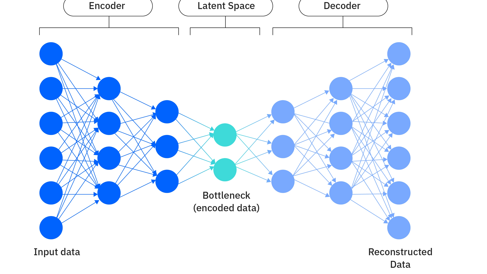

In the previous section, we introduced AutoEncoder. It uses an encoder to compress the input into latent space, and then uses a decoder to reconstruct the latent representation back into the original data. This structure is elegant and also intuitive.

But a normal AutoEncoder has a fundamental problem:

> **The latent space it learns is often not well-organized, so it is hard to use directly for generation.**

That is, although every training sample can be encoded into a point $z$, and the decoder can reconstruct the original image from this point, these points may be scattered and fragmented in the latent space. The model only needs to make sure these points can be decoded correctly. It does not care whether the whole latent space is continuous and smooth, nor whether the regions between different samples have a good structure. This leads to a direct consequence: if we randomly sample a point from the latent space and feed it into the decoder, the result often does not look like real data. In other words, a normal AutoEncoder is more like doing compression and reconstruction, rather than doing generation modeling in the real sense.

The idea of VAE [@kingma2022VAE] is to introduce a latent variable $z$. This $z$ is no longer a point, but a probability distribution. It is used to represent the latent factors that are invisible, but truly determine how the data is generated. For example, a face image $x$ looks on the surface like it is just made of a large number of pixels. But behind these pixels, the factors that really affect it may be pose, lighting, expression, hairstyle, or even the characteristics of the person’s identity. These factors are usually not explicitly labeled, but they are indeed controlling how this image is formed.

Therefore, we hope to use a latent variable $z$ to capture these latent factors. In this way, the data $x$ is no longer treated as something that appears out of nowhere. Instead, it is first determined by some latent state $z$, and then $z$ generates the final observed data $x$.

This is the core idea of **VAE (Variational Autoencoder)**. Instead of directly modeling in the high-dimensional data space, we first assume that behind the data there is a lower-dimensional and more structured latent space, and let the model learn the probability distribution of this latent space, as well as the way to generate data from this space.


```{python}
import math

import torch
import torch.nn as nn
from torch import Tensor

print('PyTorch version:', torch.__version__)
```

## 13.2.1 From Deterministic Encoding to Probabilistic Encoding

In a normal AutoEncoder, an input $x$ is mapped by the encoder to a deterministic vector:

$$ z = f_\theta(x) $$

That is, one sample corresponds to one point in latent space.

VAE is different. It no longer encodes a sample into a deterministic point, but encodes it into a probability distribution:

$$ q_\phi(z \mid x) $$

Usually, we set this distribution to be a Gaussian distribution:

$$ q_\phi(z \mid x) = \mathcal{N}(z; \mu(x), \sigma^2(x)) $$

The encoder of VAE no longer directly outputs a latent vector. Instead, it outputs two quantities:

- mean $\mu(x)$
- variance $\sigma^2(x)$ (in practice, it often outputs $\log \sigma^2(x)$ to avoid numerical instability)

As a result, one sample $x$ no longer corresponds to a single point in the latent space, but corresponds to a small probability region in the latent space.

The following is a schematic diagram of the VAE network structure:

<figure class="figure" style="text-align: center;">
  
  <figcaption>Figure 1: VAE network structure [@IBM2026VAE]</figcaption>
</figure>

So, the latent space of a normal AutoEncoder is like assigning each image an exact coordinate. What VAE wants to do is to let the neighborhood around these coordinate points also carry some probability density, so that each image corresponds to a small cloud. At the same time, these clouds should be connected and smooth as much as possible, and should overall stay close to a simple prior distribution, usually a standard normal distribution. In this way, the latent space is no longer fragmented, but becomes more continuous and more suitable for sampling.

## 13.2.2 What VAE Wants to Model

From the perspective of a generative model, what we really care about is how the data is generated. The following is the process of VAE:

First, sample a latent variable from a simple prior distribution:

$$ z \sim p(z) $$

Usually we choose the standard normal distribution:

$$ p(z) = \mathcal{N}(0, I) $$

Then generate data $x$ according to $z$:

$$ x \sim p_\theta(x \mid z) $$

Here, $p_\theta(x \mid z)$ is parameterized by the decoder.

So, the modeling idea behind VAE is that the observed data $x$ is not produced directly, but is produced by some hidden variable $z$ through a generation process.

Multiplying these two steps together, the whole joint distribution can be written as:

$$ p_\theta(x, z) = p(z)\, p_\theta(x \mid z) $$

But the problem is that during training, we can only observe $x$, and we cannot observe $z$. So we need to integrate out $z$ and obtain the marginal distribution:

$$ p_\theta(x) = \int p_\theta(x, z)\, dz = \int p(z)\, p_\theta(x \mid z)\, dz $$

Here, $p(z)$ defines the overall shape of the latent space, and $p_\theta(x \mid z)$ describes how to generate observed data from a latent variable.

If this model is learned well, then generating a new sample becomes very simple. First sample a $z$ from $p(z)=\mathcal{N}(0, I)$, and then use the decoder to generate an $x$. This is generation in the real sense.

So, our training objective is to make the model-learned $p_\theta(x)$ as close as possible to the real data distribution $p_{\text{data}}(x)$. The criterion for measuring the “closeness” between two distributions is to minimize the KL divergence:

$$ \min_\theta D_{\text{KL}}(p_{\text{data}}(x) \parallel p_\theta(x)) $$

Let us expand the KL divergence:

$$
\begin{aligned}
D_{\text{KL}}(p_{\text{data}}(x) \parallel p_\theta(x)) &= \mathbb{E}_{x \sim p_{\text{data}}} \left[\log \frac{p_{\text{data}}(x)}{p_\theta(x)}\right] \\
&= \mathbb{E}_{x \sim p_{\text{data}}} [\log p_{\text{data}}(x)] - \mathbb{E}_{x \sim p_{\text{data}}} [\log p_\theta(x)] \\
\end{aligned}
$$

For the first term, it is a constant, because $p_{\text{data}}$ is fixed and is not affected by $\theta$. The second term is what we can optimize. Therefore, minimizing the KL divergence is equivalent to maximizing the second term:

$$ \max_\theta \mathbb{E}_{x \sim p_{\text{data}}} [\log p_\theta(x)] $$

However, in reality, we do not know the analytical form of the true distribution, so we can only use the sample average to approximate the expectation:

$$ \mathbb{E}_{x \sim p_{\text{data}}} [\log p_\theta(x)] \approx \frac{1}{N}\sum_{i=1}^{N} \log p_\theta(x^{(i)}) $$

So, the optimization objective of VAE is to maximize the marginal likelihood of the data:

$$ \max_\theta \sum_{i=1}^{N} \log p_\theta(x^{(i)}) $$

At this point, you may think: since the goal is to let the model fit $p_\theta(x)$, can we not just maximize it directly?

Theoretically, yes. We want to maximize:

$$ \log p_\theta(x) $$

But the problem is that

$$ p_\theta(x) = \int p(z)\, p_\theta(x \mid z)\, dz $$

This integral is usually very hard to compute directly. Especially when the decoder is a neural network, it is almost impossible to solve analytically. More troublesome is that if we want to know which latent variables are most likely to produce a given sample $x$, we need the posterior distribution:

$$ p_\theta(z \mid x) $$

According to Bayes’ rule:

$$ p_\theta(z \mid x) = \frac{p(z)p_\theta(x \mid z)}{p_\theta(x)} $$

But the hard-to-compute $p_\theta(x)$ appears again in the denominator. So this posterior is usually also very hard to solve exactly.

This is the core difficulty faced by VAE: we want to do probabilistic generation modeling, but the true posterior $p_\theta(z \mid x)$ is hard to compute directly. What should we do then?

## 13.2.3 Variational Inference: Using a Learnable Distribution to Approximate the Posterior

The solution of VAE is very clever: since the true posterior is hard to compute, we introduce another easy-to-compute distribution to approximate it.

This approximate distribution is denoted as:

$$ q_\phi(z \mid x) $$

It is given by the encoder network, and $\phi$ is the parameter of the encoder.

Therefore, VAE is actually learning two things at the same time:

- The encoder learns an approximate posterior $q_\phi(z \mid x)$, which is used to infer the distribution of the latent variable;
- The decoder learns a generative model $p_\theta(x \mid z)$, which is used to generate data from the latent variable.

This forms a symmetric structure:

$$ x \xrightarrow{\text{encoder}} q_\phi(z \mid x) \quad\text{and}\quad z \xrightarrow{\text{decoder}} p_\theta(x \mid z) $$

It looks very similar to a normal AutoEncoder, but the encoder of a normal AutoEncoder outputs a point, while the encoder of VAE outputs a distribution. This step is the key transition from representation learning to probabilistic generation modeling.

At this point, you may ask again: why can this $q_\phi(z \mid x)$ approximate the true posterior $p_\theta(z \mid x)$? And how should we train it?

In fact, for $\log p_\theta(x)$, we have the following identity:

$$ \log p_\theta(x) = \mathbb{E}_{q_\phi(z \mid x)}[\log p_\theta(x \mid z)] - D_{\mathrm{KL}}(q_\phi(z \mid x)\,\|\,p(z)) + D_{\mathrm{KL}}(q_\phi(z \mid x)\,\|\,p_\theta(z \mid x)) $$

The full derivation will be given in the next section. Here, we first understand this equation intuitively.

**Part 1: Reconstruction should be as good as possible**

We hope to recover the input $x$ from the latent variable $z$ as much as possible. That is, the $z$ obtained through the encoder should preserve enough information related to the original input, so that the decoder can reconstruct a result that is as close to $x$ as possible according to $z$.

This corresponds to the first term in the equation above:

$$ \mathbb{E}_{q_\phi(z\mid x)}\left[\log p_\theta(x\mid z)\right] $$

This term is usually called the **reconstruction term**. For the latent variable distribution $q_\phi(z\mid x)$ given by the encoder, we sample $z$ from it, and then let the decoder reconstruct the input $x$ according to $z$. If the reconstruction is more accurate, then $p_\theta(x\mid z)$ becomes larger, the corresponding $\log p_\theta(x\mid z)$ also becomes larger, and therefore the value of this term becomes larger.

**Part 2: The latent space should be as well-organized as possible**

We also hope that the distribution $q_\phi(z \mid x)$ output by the encoder is not too arbitrary, but stays as close as possible to the prior distribution $p(z)=\mathcal{N}(0,I)$.

This corresponds to the second term in the equation above:

$$ D_{\mathrm{KL}}(q_\phi(z \mid x)\,\|\,p(z)) $$

This term is usually called the **regularization term**. Its role is to prevent each sample from occupying an isolated island randomly in latent space. Instead, it encourages the encoding distributions of all samples to stay close to the standard normal distribution as a whole. In this way, the entire latent space becomes smoother, more continuous, and easier to sample from.

**Part 3: Approximate the true posterior**

The third term in the equation above is:

$$ D_{\mathrm{KL}}(q_\phi(z \mid x)\,\|\,p_\theta(z \mid x)) $$

It measures the gap between the approximate posterior $q_\phi(z \mid x)$ that we introduced and the true posterior $p_\theta(z \mid x)$. We hope this gap is as small as possible, so that $q_\phi(z \mid x)$ can better approximate the true posterior. Of course, we cannot directly optimize this term, because $p_\theta(z \mid x)$ is unknown. But we can indirectly approximate the true posterior by optimizing the first two terms. The error with respect to the true posterior is reflected in this KL divergence term.

So, the core idea of VAE can be summarized in one sentence:

> **The goal of VAE is to maximize the marginal likelihood of the data, while introducing an approximate posterior to approximate the true posterior, and using the KL divergence term to regularize the latent space.**

## 13.2.4 Reparameterization Trick: Move the Randomness Outside

After solving the objective function of VAE, we can start training. We know that in a normal AutoEncoder, $z = f_\theta(x)$ is a deterministic value. But in VAE, we have:

$$ z \sim q_\phi(z \mid x) $$

That is, we no longer directly feed the latent vector output by the encoder into the decoder as in AE. Instead, we treat the distribution output by the encoder as a probabilistic model, **sample** a $z$ from it, and then feed this $z$ into the decoder.

For example, if the encoder outputs $\mu(x)$ and $\sigma(x)$, then it corresponds to the following normal distribution:

$$ z \sim \mathcal{N}(\mu(x), \sigma^2(x)) $$

Then we want to sample from this normal distribution.

But this creates a big problem:

> **The sampling operation itself is not differentiable.**

Neural network training depends on backpropagation. If there is a random sampling step in the middle, it becomes hard for the gradient to propagate from the decoder back to the encoder, and naturally the model cannot be trained. So what should we do this time?

Remember that we want the whole latent space to stay close to the standard normal distribution. When the encoder outputs a Gaussian distribution, we can use a very important trick: **reparameterization**.

That is, VAE does not directly sample hard from $\mathcal{N}(\mu, \sigma^2)$. Instead, it rewrites the sampling as:

$$ \epsilon \sim \mathcal{N}(0, I) $$
$$ z = \mu + \sigma \odot \epsilon $$

Its idea is very simple:

- The randomness comes from a noise $\epsilon$ that is independent of the parameters
- $\mu$ and $\sigma$ are output by the encoder network
- $z$ is a deterministic function of $\mu,\sigma,\epsilon$

As a result, the originally non-differentiable sampling becomes a differentiable transformation. After this transformation, $\epsilon$ can be sampled directly, while $\mu$ and $\sigma$ are still in the computation graph, so the loss function can smoothly compute gradients with respect to the encoder parameters. In other words, we are not asking the network to directly output a random variable. Instead, we ask the network to output how to transform standard noise into the target distribution.

## 13.2.5 PyTorch Implementation of VAE

Below is a minimal schematic code for the encoding part of VAE. The key point is the reparameterization part.

```{python}
class VAE(nn.Module):
    def __init__(
        self,
        input_shape: tuple[int, int, int],
        hidden_dim: int = 256,
        latent_dim: int = 32,
    ):
        super().__init__()
        self.input_shape = tuple(input_shape)
        self.latent_dim = latent_dim
        input_dim = math.prod(input_shape)
        self.encoder = nn.Sequential(
            nn.Flatten(),
            nn.Linear(input_dim, hidden_dim),
            nn.ReLU(),
        )
        self.fc_mu = nn.Linear(hidden_dim, latent_dim)
        self.fc_logvar = nn.Linear(hidden_dim, latent_dim)
        self.decoder = nn.Sequential(
            nn.Linear(latent_dim, hidden_dim),
            nn.ReLU(),
            nn.Linear(hidden_dim, input_dim),
            nn.Sigmoid(),
            nn.Unflatten(1, input_shape),
        )

    def encode(self, x: Tensor) -> tuple[Tensor, Tensor]:
        h = self.encoder(x)
        mu = self.fc_mu(h)
        logvar = self.fc_logvar(h)
        return mu, logvar

    def reparameterize(self, mu: Tensor, logvar: Tensor) -> Tensor:
        std = torch.exp(0.5 * logvar)
        eps = torch.randn_like(std)
        latent = torch.addcmul(mu, std, eps)
        return latent

    def decode(self, z: Tensor) -> Tensor:
        x_hat = self.decoder(z)
        return x_hat

    def forward(self, x: Tensor) -> tuple[Tensor, Tensor, Tensor]:
        mu, logvar = self.encode(x)
        latent = self.reparameterize(mu, logvar)
        x_hat = self.decode(latent)
        return x_hat, mu, logvar
```

There are several key points here:

- The encoder does not output only one latent vector at the end. Instead, it outputs `mu` and `logvar`;
- The `reparameterize()` function implements $z = \mu + \sigma \odot \epsilon$.

For the line `std = torch.exp(0.5 * logvar)`, we have:

$$ \log \sigma^2 = \text{logvar} \quad \Rightarrow \quad \sigma = \exp\left(\frac{1}{2}\log \sigma^2\right) $$

This form is very common in practice, because directly predicting the variance can easily lead to numerical instability, while predicting the log-variance is more convenient.

## 13.2.6 Chapter Summary

So, compared with a normal AE, what VAE really adds is not just a slightly more complicated structure, but a change in the modeling idea.

The idea of a normal AE is:

- Learn a compressed representation
- Then reconstruct the input from this representation

The idea of VAE is:

- Assume that data is generated by a latent variable
- Use the prior $p(z)$ to constrain the latent space
- Use the approximate posterior $q_\phi(z|x)$ to infer the hidden variable
- Use the decoder to model the generation process $p_\theta(x|z)$

It is essentially a **probabilistic generative model**, not just a reconstruction model. To summarize it in one sentence, AutoEncoder learns how to compress and recover data, while VAE learns how data is generated from latent variables.

At this point, we have understood the basic idea of VAE. But there is still one core question that we have not formally answered:

> **Where does the loss function of VAE come from? Why does that identity exist?**

This requires introducing the content of the next section: **Evidence Lower Bound (ELBO)**.
