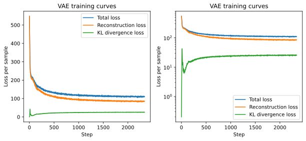
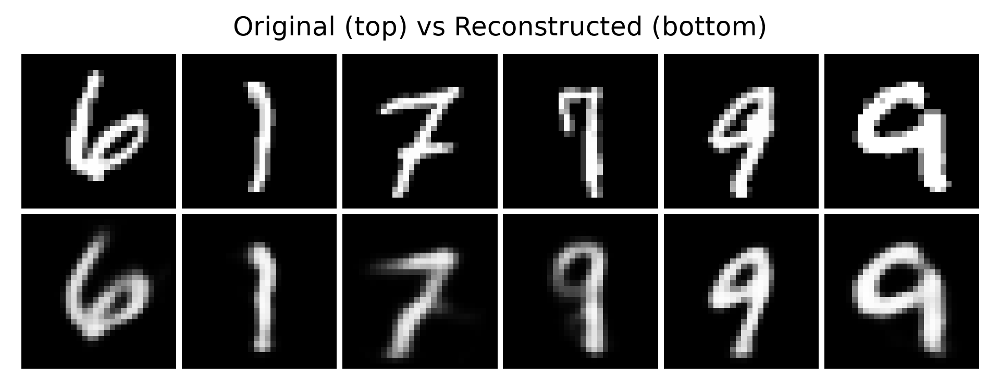
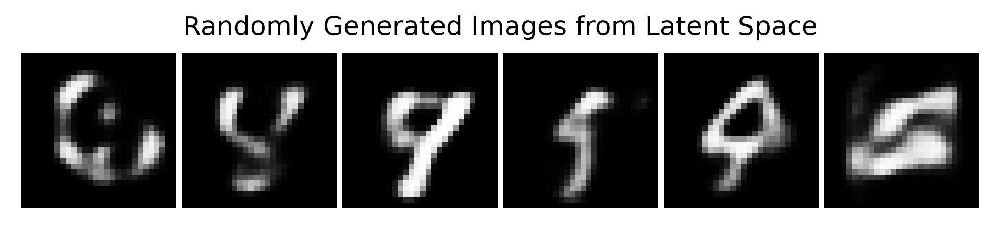
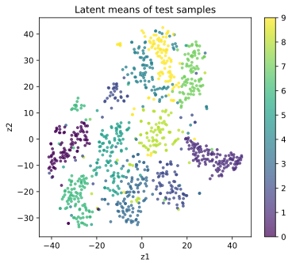
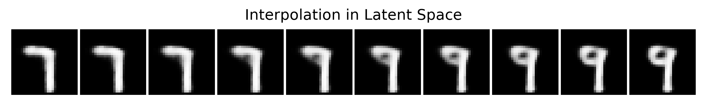
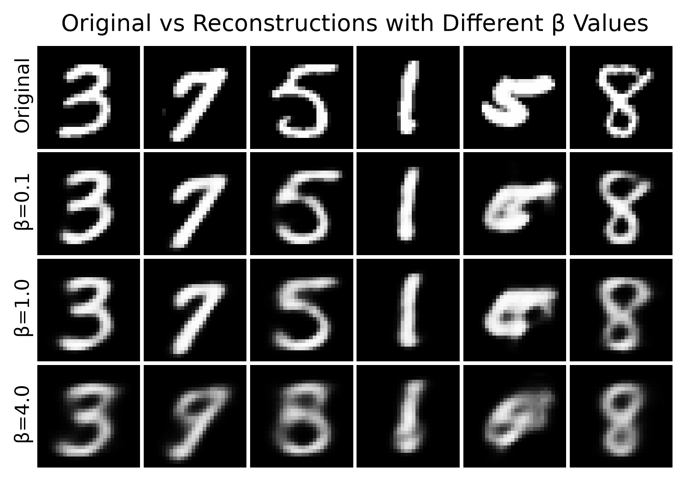

Previously, we already knew that the objective function of VAE consists of two parts:

$$ \mathcal{L}(x)=\mathbb{E}_{q_\phi(z\mid x)}[\log p_\theta(x\mid z)]-D_{\mathrm{KL}}(q_\phi(z\mid x)\,\|\,p(z)) $$

If we write it as the loss minimized during training, it is:

$$ \text{loss}=\text{reconstruction loss}+\text{KL loss} $$

But just looking at the formula is not enough. To really understand VAE, the most important thing is to see what phenomena appear during training:

- The reconstruction result is usually good, but often blurrier than GAN
- The latent space is often more continuous and smoother
- Sampling from the standard normal distribution can usually generate decent samples
- When KL is too strong or too weak, the model behavior changes noticeably

In this section, we do not only talk about conclusions. Instead, we directly observe these phenomena through code. To make it easier to observe the distribution of the latent space, we use t-SNE to visualize the latent space and train a small VAE on MNIST.

```{python}
from collections import defaultdict

import matplotlib.pyplot as plt
import torch
import torch.optim as optim
import torch.utils.data as utils
import torchvision.datasets as datasets
import torchvision.transforms.v2 as v2
from sklearn.manifold import TSNE
from torchmetrics.aggregation import MeanMetric
from torchvision.utils import make_grid

plt.rc('savefig', dpi=300, bbox='tight')
print('PyTorch version:', torch.__version__)
```

```{python}
torch.manual_seed(42)
torch.use_deterministic_algorithms(False)
torch.backends.cudnn.deterministic = False
torch.backends.cudnn.benchmark = True

device = torch.accelerator.current_accelerator(check_available=True)
if device is None:
    device = torch.device('cpu')
print(f'Using device: {device}')
```

## 13.4.1 Train a Minimal VAE

### 13.4.1.1 Dataset Preparation

Here we create the MNIST dataset.

```{python}
# Change the path to your dataset directory if needed
root = 'D:/Workspaces/Python Project/datasets'
transform = v2.Compose([v2.ToImage(), v2.ToDtype(torch.float32, scale=True)])
train_ds = datasets.MNIST(root, train=True, download=True, transform=transform)
test_ds = datasets.MNIST(root, train=False, download=True, transform=transform)

train_dl = utils.DataLoader(train_ds, batch_size=256, shuffle=True, drop_last=True)
```

### 13.4.1.2 Define the VAE and the Loss Function

Here we directly use the VAE model and ELBO loss function defined in the previous sections. At the same time, to avoid making the value of the loss function too large, we sum up the loss function values and then divide by the number of samples in the current batch.

```{python}
from dnnl.ch13 import VAE, vae_loss

input_shape = (1, 28, 28)
model = VAE(input_shape).to(device)
optimizer = optim.Adam(model.parameters(), lr=1e-3)
```

### 13.4.1.3 Train the VAE Model

Here we separately record the total loss:

- `recon_loss`: the loss of the reconstruction term
- `kl_loss`: the loss of the KL term
- `beta`: the weight of the KL term

We first start from the most standard case, namely `beta = 1.0`. Later, we will change this value and observe different training phenomena.

```{python}
num_epochs = 10
global_step = 0
history = defaultdict(list)

loss_metric = MeanMetric().to(device)
recon_loss_metric = MeanMetric().to(device)
kl_loss_metric = MeanMetric().to(device)

model.train()
for epoch in range(1, num_epochs + 1):
    loss_metric.reset()
    recon_loss_metric.reset()
    kl_loss_metric.reset()

    for x, _ in train_dl:
        x = x.to(device)
        x_hat, mu, logvar = model(x)
        loss, recon_loss, kl_loss = vae_loss(x_hat, x, mu, logvar)
        loss.backward()

        loss_metric.update(loss.detach())
        recon_loss_metric.update(recon_loss.detach())
        kl_loss_metric.update(kl_loss.detach())

        optimizer.step()
        optimizer.zero_grad()

        history['loss'].append(loss.item())
        history['recon_loss'].append(recon_loss.item())
        history['kl_loss'].append(kl_loss.item())

        global_step += 1

    print(
        f'Epoch [{epoch:2d}/{num_epochs:2d}] | '
        f'loss: {loss_metric.compute():.4f} | '
        f'recon_loss: {recon_loss_metric.compute():.4f} | '
        f'kl_loss: {kl_loss_metric.compute():.4f}'
    )
```

```{python}
fig = plt.figure(1, figsize=(10, 4))
axes = fig.subplots(1, 2)
for ax in axes:
    ax.plot(history['loss'], label='Total loss')
    ax.plot(history['recon_loss'], label='Reconstruction loss')
    ax.plot(history['kl_loss'], label='KL divergence loss')
    ax.set_xlabel('Step')
    ax.set_ylabel('Loss per sample')
    ax.set_title('VAE training curves')
axes[0].legend(loc='upper right')
axes[1].legend(loc='lower right')
axes[1].set_yscale('log')
fig.savefig('figures/ch13.4-vae-training-curves.svg')
plt.close(fig)
```

<figure class="figure" style="text-align: center;">
  
</figure>

The left side of the figure above is the loss curve on the original scale, and the right side is on the logarithmic scale. At the beginning, the reconstruction loss is large, but as training proceeds, the reconstruction loss drops quickly. The KL loss is very small at the beginning and oscillates back and forth in the first few steps, but as training proceeds, it gradually increases and finally becomes stable. The overall trend of the total loss is the same as the reconstruction loss, but because the KL loss increases, it decreases a bit more slowly than the reconstruction loss. The model converges after about 2000 steps.

This shows that what VAE optimizes during training is not separately minimizing the KL loss, but making a trade-off between the reconstruction term and the KL regularization term. To obtain a better reconstruction result, the model needs the posterior distribution $q_\phi(z \mid x)$ to carry more information about the input data $x$; but when $q_\phi(z \mid x)$ depends more on the input data, it will deviate from the prior distribution $p(z)$, which causes the KL loss to increase. During training, the model will gradually find a balance point, so that both the reconstruction loss and the KL loss are optimized reasonably. Therefore, the increase of KL does not necessarily mean that training is abnormal. Instead, it often means that the model has started to effectively use latent variables to represent the input data.

Next, let us look at several important phenomena of VAE.

## 13.4.2 Phenomenon 1: VAE Can Reconstruct, but the Results Are Often Smooth

The decoder of VAE is not memorizing a single point. Instead, it is handling a latent variable distribution with randomness. This makes the learned representation smoother, but it also often makes the reconstruction result look softer and blurrier.

Below, we put the original images and reconstructed images together.

```{python}
num_samples = 6
samples_idx = torch.randperm(len(test_ds))[:num_samples]
original = [test_ds[int(idx)][0] for idx in samples_idx]
original = torch.stack(original).to(device)

model.eval()
with torch.inference_mode():
    reconstructed, *_ = model(original)

image_list = torch.concat([original, reconstructed], dim=0)
grid = make_grid(image_list, nrow=num_samples, padding=1, pad_value=1)
grid = grid.permute(1, 2, 0).numpy(force=True)  # CxHxW -> HxWxC

fig = plt.figure(2, figsize=(8, 3))
ax = fig.add_subplot(1, 1, 1)
ax.imshow(grid, cmap='gray')
ax.axis('off')
ax.set_title('Original (top) vs Reconstructed (bottom)')
fig.savefig('figures/ch13.4-reconstructed.png')
plt.close(fig)
```

<figure class="figure" style="text-align: center;">
  
</figure>

If you compare it with a normal AutoEncoder, you will find that the reconstruction of AutoEncoder is usually sharper, because it does not need to obey a prior probability. The reconstruction of VAE is often smoother, because it must keep the latent space continuous and sampleable. This is also why many people, when they first look at the generation results of VAE, feel that it is a little blurry. This blur does not necessarily mean that the model failed to learn. Instead, it is the price it pays for a latent space that is generatable, interpolatable, and sampleable.

## 13.4.3 Phenomenon 2: Sampling from the Standard Normal Really Can Generate New Samples

One key advantage of VAE is that after training is finished, we can directly sample from the prior distribution $z \sim \mathcal{N}(0, I)$, and then generate images through the decoder. Compared with images generated by AE, which are often only noise and do not carry any structure, images generated by VAE can usually show clear digit shapes, although they may be relatively blurry. This shows that what VAE learns is not simply a compressor, but a real generative model.

```{python}
num_samples = 6
z = torch.randn(num_samples, model.latent_dim).to(device)

model.eval()
with torch.inference_mode():
    x_hat = model.decode(z)

grid = make_grid(x_hat, nrow=num_samples, padding=1, pad_value=1)
grid = grid.permute(1, 2, 0).numpy(force=True)  # CxHxW -> HxWxC

fig = plt.figure(3, figsize=(8, 2))
ax = fig.add_subplot(1, 1, 1)
ax.imshow(grid, cmap='gray')
ax.axis('off')
ax.set_title('Randomly Generated Images from Latent Space')
fig.savefig('figures/ch13.4-randomly-generated.png')
plt.close(fig)
```

<figure class="figure" style="text-align: center;">
  
</figure>

The results generated in this step still look quite like handwritten digits. Although they are still blurry, at least they already have obvious digit shapes. This shows that the KL term indeed pulls the latent space toward the neighborhood of the standard normal distribution, and the decoder has indeed learned how to interpret this latent space as data. This is exactly what a normal AutoEncoder has difficulty doing stably. The latent space of a normal AE is often very scattered. Just like the experiment in Section 13.1, if we randomly sample a point, the decoder often outputs a very strange result.

## 13.4.4 Phenomenon 3: The Latent Space Is Continuous, Not Fragmented

To look at the latent space, we encode each test image into the mean vector $\mu(x)$. Then, because the dimension is relatively high, namely 32 dimensions, we use t-SNE to reduce the dimensionality of these mean vectors for visualization. We also use different colors to mark digits from different classes.

```{python}
num_samples = 1000
samples_idx = torch.randperm(len(test_ds))[:num_samples]
samples_batch = [test_ds[int(idx)][0] for idx in samples_idx]
samples_batch = torch.stack(samples_batch).to(device)

model.eval()
with torch.inference_mode():
    mu_list, _ = model.encode(samples_batch)

mu_list = mu_list.numpy(force=True)
label_list = test_ds.targets[samples_idx].numpy()

Mdl = TSNE(n_components=2, random_state=42)
mu_2d = Mdl.fit_transform(mu_list)

fig = plt.figure(4, figsize=(6, 5))
ax = fig.add_subplot(1, 1, 1)
scatter = ax.scatter(mu_2d[:, 0], mu_2d[:, 1], c=label_list, s=8, alpha=0.7)
fig.colorbar(scatter)
ax.set_xlabel('z1')
ax.set_ylabel('z2')
ax.set_title('Latent means of test samples')
fig.savefig('figures/ch13.4-latent-space.svg')
plt.close(fig)
```

<figure class="figure" style="text-align: center;">
  
</figure>

We can see that digits of the same class form relatively nearby regions in the latent space. Different digits are not completely separated, but have some continuous transitions. The overall distribution of the latent space will not diverge without bound, but will be pulled by the KL term near the center. The latent space learned by VAE can not only encode data, but also often has a geometric structure.

Precisely because of this, VAE is especially suitable for interpolation.

## 13.4.5 Phenomenon 4: Latent Space Interpolation Is Usually Smooth

If the latent space is truly continuous, then when we do linear interpolation between two samples, the results generated by the decoder should also change smoothly, rather than suddenly jump. Below, we randomly take two test images, first encode them to obtain their corresponding mean vectors, and then interpolate between these two points.

```{python}
num_samples = 2
num_steps = 10
samples_idx = torch.randperm(len(test_ds))[:num_samples]

model.eval()
x1, _ = test_ds[int(samples_idx[0])]
x2, _ = test_ds[int(samples_idx[1])]
x1 = x1.unsqueeze(0).to(device)
x2 = x2.unsqueeze(0).to(device)

with torch.inference_mode():
    mu1, _ = model.encode(x1)
    mu2, _ = model.encode(x2)

    alphas = torch.linspace(0, 1, num_steps, device=device).view(-1, 1)
    z_list = torch.lerp(mu1, mu2, alphas)
    x_hat = model.decode(z_list)

x_hat = make_grid(x_hat, nrow=num_steps, padding=1, pad_value=1)
x_hat = x_hat.permute(1, 2, 0).numpy(force=True)  # CxHxW -> HxWxC

fig = plt.figure(5, figsize=(num_steps, 2))
ax = fig.add_subplot(1, 1, 1)
ax.imshow(x_hat, cmap='gray')
ax.axis('off')
ax.set_title('Interpolation in Latent Space')
fig.savefig('figures/ch13.4-interpolation.png')
plt.close(fig)
```

<figure class="figure" style="text-align: center;">
  
</figure>

You will find that the interpolation result changes smoothly, rather than suddenly jumping. As the interpolation coefficient changes from 0 to 1, the digit shape slowly changes, and the strokes gradually move, bend, or merge. Although the intermediate states are not necessarily standard digits, they usually do not look like noise. This shows that the latent space is not a pile of unrelated discrete points, but is more like a continuous semantic space.

## 13.4.6 What Happens When the KL Term Is Too Strong or Too Weak

Now let us look at a very key point in VAE training: the weight of the KL term significantly affects the model behavior.

We write the loss as:

$$ \text{loss} = \text{reconstruction loss} + \beta \cdot \text{KL loss} $$

Here, $\beta$ is used to control the strength of KL. If $\beta$ is too small, the model cares more about reconstruction, and the latent space may become irregular. If $\beta$ is too large, the model cares more about staying close to the prior, and the reconstruction may become noticeably worse.

Below, we use a small experiment to quickly compare the effect of different $\beta$ values. To save time, we only train for a small number of epochs.

```{python}
betas = [0.1, 1.0, 4.0]
models = {}

for beta in betas:
    print(f'Training beta={beta}...')
    model = VAE(input_shape).to(device)
    optimizer = optim.Adam(model.parameters(), lr=1e-3)

    for epoch in range(5):
        model.train()

        for x, _ in train_dl:
            x = x.to(device)
            x_hat, mu, logvar = model(x)
            loss, *_ = vae_loss(x_hat, x, mu, logvar, beta=beta)
            loss.backward()

            optimizer.step()
            optimizer.zero_grad()

    models[beta] = model.eval()
```

```{python}
num_samples = 6
samples_idx = torch.randperm(len(test_ds))[:num_samples]
original = [test_ds[int(idx)][0] for idx in samples_idx]
original = torch.stack(original).to(device)

reconstructed = []
with torch.inference_mode():
    for beta in betas:
        x_hat, *_ = models[beta](original)
        reconstructed.append(x_hat)

image_list = torch.concat([original] + reconstructed, dim=0)
grid = make_grid(image_list, nrow=num_samples, padding=1, pad_value=1)
grid = grid.permute(1, 2, 0).numpy(force=True)

fig = plt.figure(6, figsize=(num_samples, 2 * (len(betas) + 1)))
ax = fig.add_subplot(1, 1, 1)
ax.imshow(grid, cmap='gray')

row_labels = ['Original'] + [f'β={beta}' for beta in betas]
for i, label in enumerate(row_labels):
    ax.text(-0.5, i * 29 + 14, label, ha='right', va='center', rotation=90, fontsize=10)

ax.axis('off')
ax.set_title('Original vs Reconstructions with Different β Values')
fig.savefig('figures/ch13.4-beta-comparison.png')
plt.close(fig)
```

<figure class="figure" style="text-align: center;">
  
</figure>

In the figure, the first row is the original image, the second row is the reconstruction with $\beta=0.1$, the third row is the reconstruction with $\beta=1.0$, and the fourth row is the reconstruction with $\beta=4.0$.

We can see that when $\beta$ is very small, the reconstruction result is clearer, but the latent space is more likely to wander around. When directly sampling from the standard normal distribution, the generation quality is not necessarily stable. When $\beta$ is larger, the latent space becomes more regular and sampling becomes more stable, but reconstruction is more likely to become blurry and even lose details.

This is one kind of trade-off in VAE. When we want the latent space to be prettier, continuous, and obey the prior, we may sacrifice some reconstruction accuracy. Conversely, if we want clearer reconstruction, we may get a less regular latent space, and the model then degenerates into a normal AutoEncoder, losing the generative ability of VAE.

## 13.4.7 A Common Failure Phenomenon: Posterior Collapse

On some stronger decoders, VAE also encounters a famous problem: **posterior collapse**.

It means that during training, the posterior distribution $q_\phi(z\mid x)$ output by the encoder gradually becomes exactly the same as the prior distribution $p(z)$, causing the KL term to be almost zero. At this point, the decoder can complete the generation task almost without depending on the latent variable $z$, and in the end the latent variable loses its role of carrying information.

Intuitively, this is like the model saying:

> Since the decoder is already very strong, I might as well not seriously use the latent code.

In simple experiments such as MNIST, this problem may not be particularly obvious. But in text generation, strong autoregressive decoders, or complex models, it becomes a very practical problem. We can use some methods to alleviate this problem, use a more suitable decoder structure, and use variants such as $\beta$-VAE and InfoVAE for adjustment. We do not need to remember all of these techniques right now, but we need to know that VAE training is not always naturally stable. The design and weight of the KL term are very important.

## 13.4.8 Summary of This Chapter

Now let us summarize the important intuitions behind VAE training phenomena:

1. The reconstruction of VAE is usually relatively smooth. It does not only pursue pixel-level fitting, but also needs the latent space to satisfy a probabilistic structure.
2. VAE can generate directly by sampling from the standard normal distribution. This shows that what it learns is a truly generatable latent space.
3. The latent space often has a continuous structure. Samples of the same class are close to each other, and different samples can be smoothly interpolated.
4. The KL term controls the balance between reconstruction ability and latent-space regularity. If it is too weak, the latent space will scatter; if it is too strong, reconstruction will become blurry.

VAE is the foundation of a series of later generative models. Understanding its training phenomena and latent-space intuition is very important for our later study of diffusion, latent diffusion, and other models. It is not only a generative model, but also a tool for learning latent-space structure. This is also why it has an important position in the field of generative models.

## 13.4.9 Exercises

You can continue modifying the code above yourself and observe more phenomena:

1. Change `latent_dim` from 32 to 4, 8, and 16, and see what changes happen to reconstruction and sampling.
2. Change `beta` to a smaller or larger value, and compare the latent-space distributions of different models.
3. Try changing the reconstruction term from BCE to MSE, and observe the change in the style of generated images.
4. Increase the number of training epochs to 15 or 20, and see whether the latent-space visualization becomes clearer.
5. Compare the interpolation results of a normal AutoEncoder and VAE, and understand what exactly a “regular latent space” brings.
