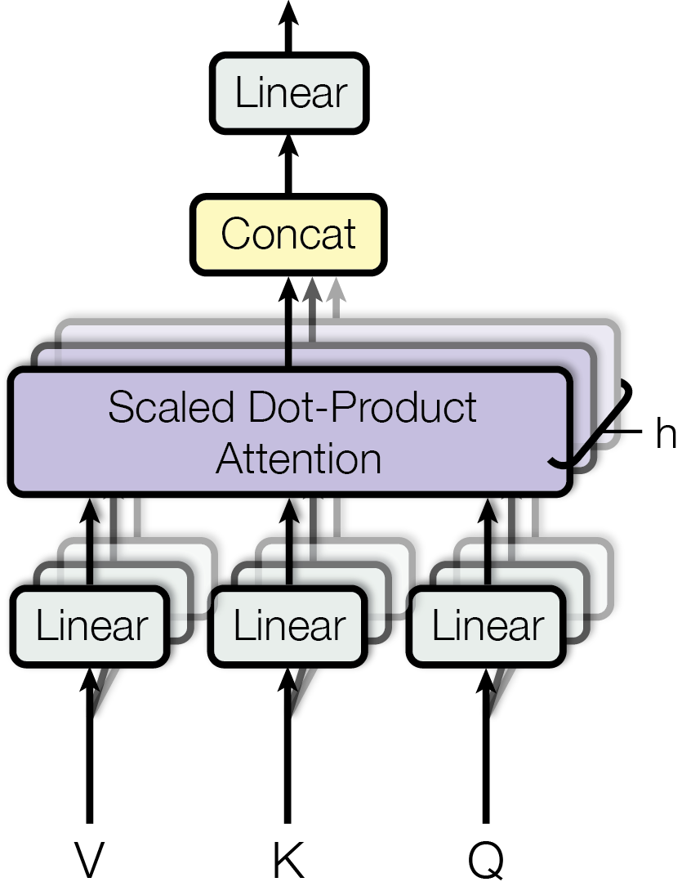
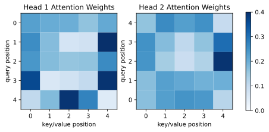

In the previous section, we saw that self-attention allows each position in a sequence to directly build connections with other positions. For a certain token, it no longer has to rely only on the previous hidden state, and it does not need to indirectly see distant information through many convolution layers. Instead, it can aggregate context from the entire sequence at once based on relevance.

If we only look at this point, self-attention is already very powerful. But there is still one problem that has not been solved: the relationship between one token and other tokens is often **not just one kind**.

For example, consider the following sentence:

> The animal didn’t cross the street because it was too tired.

When the model processes `it`, it may need to pay attention to `animal`, because `it` here is more likely to refer to this animal. But at the same time, the model may also need to pay attention to `tired`, because this word determines the causal relationship in the current sentence. It may also need to pay attention to `cross` and `street`, because these words provide the event background.

In other words, when understanding a sentence, the same token may need different types of information at the same time: some information is related to coreference, some to syntactic structure, some to semantic roles, and some to local collocations. If we only use one attention head, then all these relationships have to be compressed into the same set of attention weights.

This is the problem that multi-head attention wants to solve. Its core idea is very simple:

> **Do not let the model look at the sequence from only one perspective. Instead, let it look at the sequence from multiple different perspectives at the same time.**

```{python}
import math

import matplotlib.pyplot as plt
import numpy as np
import torch
import torch.nn as nn
from torch import Tensor

plt.rc('savefig', dpi=300, bbox='tight')
print('PyTorch version:', torch.__version__)
```

## 8.4.1 The Problem with Single-Head Attention

First, let us recall the computation process of single-head self-attention. Given an input sequence representation:

$$
X \in \mathbb{R}^{n \times d_{\mathrm{model}}}
$$

where $n$ is the sequence length, and $d_{\mathrm{model}}$ is the representation dimension of each token. We obtain query, key, and value through three linear transformations:

$$
Q = XW^Q, \quad K = XW^K, \quad V = XW^V
$$

Then we compute scaled dot-product attention:

$$
\operatorname{Attention}(Q, K, V)
= \operatorname{softmax}\left(\frac{QK^\top}{\sqrt{d_k}}\right)V
$$

This mechanism allows each position to retrieve information from all values in a weighted way, according to the matching degree between query and key.

But if there is only one attention head, then the model only has one set of $W^Q, W^K, W^V$, which means it only has one projection method. In other words, the model can only judge who is related to whom in one representation space. This does not mean single-head attention has no expressive power. Rather, its way of expression is relatively concentrated. All relationships are mixed into the same attention distribution:

- Should the current word attend to the subject?
- Should the current word attend to the object?
- Should the current word attend to neighboring words?
- Should the current word attend to information representing causality, negation, or time?

These different needs all have to be expressed through the same attention matrix. The model can of course learn this, but it will be relatively limited.

An intuitive analogy is: if you read a sentence only from the perspective of semantic similarity, you can indeed get a lot of information. But when humans understand language, we often look at syntactic relations, coreference relations, modifier relations, contextual logic, and other aspects at the same time. Multi-head attention provides similar multiple observation perspectives inside the model.

## 8.4.2 The Core Idea of Multi-Head Attention

With the intuition above, we can now formally look at how multi-head attention works.

It does not invent a completely new attention computation method. Instead, it runs the same attention mechanism multiple times in parallel. Each independent attention computation is called a **head**. That is, the model no longer uses only one set of query, key, and value to observe the sequence. Instead, it prepares multiple sets of query, key, and value at the same time, so that different heads can learn different matching relationships in different representation spaces.

From the overall structure, each head first obtains its own set of $Q$, $K$, and $V$ through its own linear projections, and then independently computes scaled dot-product attention. The outputs of multiple heads are concatenated, and finally passed through a linear layer to be fused into the final multi-head attention output.

<figure class="figure" style="text-align: center;">
  
  <figcaption>Figure 1: MHA computation diagram [@vaswani2023Attention, fig. 2]</figcaption>
</figure>

For the $i$-th head, there is an independent set of linear projection matrices:

$$
W_i^Q, \quad W_i^K, \quad W_i^V
$$

After projection, it obtains its own set of query, key, and value:

$$
Q_i = XW_i^Q, \quad K_i = XW_i^K, \quad V_i = XW_i^V
$$

Then attention is computed separately for the $i$-th head:

$$
\mathrm{head}_i
= \operatorname{Attention}(Q_i, K_i, V_i)
= \operatorname{softmax}\left(\frac{Q_i K_i^\top}{\sqrt{d_k}}\right)V_i
$$

If there are $h$ heads in total, then we get:

$$
\mathrm{head}_1, \mathrm{head}_2, \dots, \mathrm{head}_h
$$

Next, we concatenate the outputs of these heads along the last dimension:

$$
\operatorname{Concat}(\mathrm{head}_1, \dots, \mathrm{head}_h)
$$

Finally, we pass it through a linear transformation $W^O$ to obtain the final output:

$$
\operatorname{MultiheadAttention}(Q, K, V)
= \operatorname{Concat}(\mathrm{head}_1, \dots, \mathrm{head}_h)W^O
$$

This is the standard form of multi-head attention.

One thing to note is that although the formula writes $Q, K, V$, in self-attention, they all come from the same input $X$; in cross-attention, $Q$ usually comes from the decoder, while $K$ and $V$ usually come from the encoder output. So multi-head attention does not change the basic mechanism of attention. It only copies the same attention mechanism into multiple heads and lets each head learn a different projection perspective.

## 8.4.3 Why Multiple Heads Are Useful

The most important role of multi-head attention is that it allows the model to model different relationships in different subspaces in parallel.

Here, a subspace can be understood like this: each head first uses its own linear layer to project the original token representation into a new representation space. Since the projection matrices of different heads are different, they do not see exactly the same features.

The same word may be projected into different representations in different heads. One head may be more likely to capture syntactic relations, another head may be more likely to capture long-distance dependencies, and another head may focus more on local neighboring words. Of course, these explanations are not manually specified in advance. They are learned by the model during training. That is, we should not understand each head as a fixed human rule, such as the first head specializing in subjects and the second head specializing in objects. Each head has independent parameters, so they have the opportunity to learn different types of matching patterns and information aggregation methods.

From this perspective, the value of multi-head attention is not that it manually defines multiple perspectives, but that it gives the model multiple perspectives that can be learned automatically.

Still using the previous sentence as an example:

> The animal didn’t cross the street because it was too tired.

When the model processes `it`, different heads may form different attention patterns. One head may put a larger weight on `animal`, because this helps solve the coreference problem. Another head may focus on `tired`, because it affects the semantic interpretation of the current phrase. Another head may focus on `cross the street`, because this provides the event background.

In the end, the results from these different heads are concatenated and then fused through the output linear layer. In this way, the model does not understand the current token from a single perspective. Instead, it combines information obtained from multiple perspectives.

However, it should be noted that although multi-head attention can model different relationships in the same sequence, this does not mean every head will necessarily learn a pattern that humans can understand. In actual training, some heads may indeed show relatively clear patterns, such as attending to the previous token, attending to separators, or attending to syntactically related words, but the behavior of many heads is not easy to interpret.

So when understanding multi-head attention, we need to avoid two extremes. One extreme is to describe it as too mysterious, as if every head automatically has some advanced language-learning function. The other extreme is to treat it as simple repeated computation, as if it just computes attention several more times. A more reasonable understanding is: the multi-head mechanism provides the model with multiple learnable representation subspaces, so the model can capture different types of relationships in parallel.

## 8.4.4 Multiple Heads Do Not Simply Increase Parameters

Then, after seeing this, a natural question is: since there are multiple heads, do the number of parameters and computation both increase by several times?

The answer is not simply “yes”. In Transformer, the total model dimension $d_{\mathrm{model}}$ is usually divided among multiple heads. Suppose there are $h$ heads. Then the dimension of each head is usually set to:

$$
d_k = d_v = \frac{d_{\mathrm{model}}}{h}
$$

For example, if $d_{\mathrm{model}} = 512$ and $h = 8$, then the dimension of each head is $64$.

The result of doing this is: each head only computes attention in a lower-dimensional subspace. Although the number of heads increases, the dimension of each head becomes smaller. Therefore, the overall computation does not simply get multiplied by $h$ because the number of heads increases.

More specifically, if single-head attention uses the full $d_{\mathrm{model}}$ dimension for computation, then the attention output dimension is $d_{\mathrm{model}}$. Multi-head attention splits this dimension into $h$ parts. Each head computes attention in $\tfrac{d_{\mathrm{model}}}{h}$ dimensions, and the results are finally concatenated back to $d_{\mathrm{model}}$.

So multi-head attention is more like splitting one large attention space into multiple smaller attention spaces, rather than simply copying many complete large attention modules. This is also why it can achieve a relatively good balance between expressive power and computational efficiency.

## 8.4.5 Understanding Multi-Head Attention from Tensor Shapes

To understand multi-head attention more concretely, we can look at the tensor shapes in common implementations.

Assume the input is:

$$
X \in \mathbb{R}^{B \times n \times d_{\mathrm{model}}}
$$

where $B$ is `batch size`, $n$ is the sequence length, and $d_{\mathrm{model}}$ is the model dimension.

After the linear layers, we usually first get:

$$
Q, K, V \in \mathbb{R}^{B \times n \times d_{\mathrm{model}}}
$$

Then we split the last dimension into the number of heads and the dimension of each head:

$$
Q, K, V \in \mathbb{R}^{B \times n \times h \times d_k}
$$

For convenient parallel computation, we usually move the head dimension to the front:

$$
Q, K, V \in \mathbb{R}^{B \times h \times n \times d_k}
$$

Next, each head computes attention scores internally:

$$
S = QK^\top \in \mathbb{R}^{B \times h \times n \times n}
$$

Here, $n \times n$ is each head's own attention matrix. Because there are $h$ heads, each Multi-Head Attention layer actually produces $h$ attention matrices.

Then we apply softmax and multiply by $V$:

$$
P = \operatorname{softmax}\left(\frac{QK^\top}{\sqrt{d_k}}\right)V
\in \mathbb{R}^{B \times h \times n \times d_k}
$$

Finally, we concatenate multiple heads back together:

$$
\mathbb{R}^{B \times h \times n \times d_k}
\rightarrow
\mathbb{R}^{B \times n \times d_{\mathrm{model}}}
$$

Then we pass it through the output projection $W^O$ to obtain the final output.

From the shape perspective, the essence of multi-head attention is: first split $d_{\mathrm{model}}$ into multiple heads, independently perform attention on each head, and then merge them back together.

## 8.4.6 PyTorch Implementation of Multi-Head Attention

Below, we write a simplified version of multi-head attention. Here, we do not consider details such as padding mask, causal mask, and dropout for now. We only focus on the core computation process.

```{python}
class MultiheadAttention(nn.Module):
    def __init__(
        self,
        attn_dim: int,
        num_heads: int,
        q_dim: int | None = None,
        k_dim: int | None = None,
        v_dim: int | None = None,
        out_dim: int | None = None,
    ):
        super().__init__()
        if attn_dim % num_heads != 0:
            raise AssertionError('`attn_dim` must be divisible by `num_heads`.')

        self.attn_dim = attn_dim
        self.num_heads = num_heads
        self.head_dim = attn_dim // num_heads

        self.q_dim = q_dim or attn_dim
        self.k_dim = k_dim or attn_dim
        self.v_dim = v_dim or attn_dim
        self.out_dim = out_dim or attn_dim

        self.q_proj = nn.Linear(self.q_dim, attn_dim)
        self.k_proj = nn.Linear(self.k_dim, attn_dim)
        self.v_proj = nn.Linear(self.v_dim, attn_dim)
        self.out_proj = nn.Linear(attn_dim, self.out_dim)

    def forward(
        self,
        q: Tensor,
        k: Tensor,
        v: Tensor,
        need_weights: bool = False,
    ) -> tuple[Tensor, Tensor | None]:
        # Make sure the sequence lengths of key and value match
        if k.size(-2) != v.size(-2):
            raise AssertionError(
                '`key` and `value` must have the same sequence length.'
            )

        batch_size, q_len, _ = q.size()
        k_len = k.size(-2)
        v_len = v.size(-2)

        q = self.q_proj(x)
        k = self.k_proj(x)
        v = self.v_proj(x)

        q = q.view(batch_size, q_len, self.num_heads, self.head_dim)
        k = k.view(batch_size, k_len, self.num_heads, self.head_dim)
        v = v.view(batch_size, v_len, self.num_heads, self.head_dim)

        q = q.transpose(1, 2)
        k = k.transpose(1, 2)
        v = v.transpose(1, 2)

        scores = q @ k.transpose(-2, -1)
        scores = scores / math.sqrt(self.head_dim)

        attn_weights = scores.softmax(dim=-1)
        attn_output = attn_weights @ v

        attn_output = attn_output.transpose(1, 2).contiguous()
        attn_output = attn_output.view(batch_size, q_len, self.attn_dim)
        output = self.out_proj(attn_output)

        if need_weights:
            return output, attn_weights

        return output, None
```

The most important parts of this code are `view` and `transpose`.

At the beginning, the shapes of `q`, `k`, and `v` are all:

```text
(batch_size, seq_len, d_model)
```

Then we split `d_model` into:

```text
(num_heads, head_dim)
```

So the shape becomes:

```text
(batch_size, seq_len, num_heads, head_dim)
```

Then, through `transpose(1, 2)`, we move the head dimension before the sequence length:

```text
(batch_size, num_heads, seq_len, head_dim)
```

After doing this, PyTorch can compute attention for all batches and all heads at the same time, without us manually writing a loop.

Finally, the outputs of multiple heads are converted back to:

```text
(batch_size, seq_len, num_heads, head_dim)
```

Then they are merged again into:

```text
(batch_size, seq_len, d_model)
```

This is the core of multi-head attention at the implementation level.

We visualize the attention matrices of multi-head attention:

```{python}
num_heads = 2
x = torch.randn(3, 5, 8)
# This is a version of multi-head self-attention.
# You can change to cross-attention by using different `k` and `v` inputs.
multihead_attn = MultiheadAttention(attn_dim=8, num_heads=num_heads)

with torch.inference_mode():
  output, attn_weights = multihead_attn(x, x, x, need_weights=True)

print('Input shape:', x.shape)
print('Attention weights shape:', attn_weights.shape)
print('Output shape:', output.shape)

fig = plt.figure(1, figsize=(4 * num_heads, 3))
axes = fig.subplots(1, num_heads)
for i, ax in enumerate(axes):
    im = ax.pcolormesh(attn_weights[0, i], cmap='Blues', vmin=0, vmax=0.4)
    ticks = np.arange(x.size(-2))
    ax.set_xticks(ticks + 0.5, ticks)
    ax.set_yticks(ticks + 0.5, ticks)
    ax.set_aspect('equal')
    ax.set_xlabel('key/value position')
    ax.set_ylabel('query position')
    ax.set_title(f'Head {i + 1} Attention Weights')
axes[0].invert_yaxis()
cbar_ticks = np.arange(0, 0.5, 0.1)
fig.colorbar(im, ax=axes, ticks=cbar_ticks)
fig.savefig('figures/ch8.4-multi-head-attn-weights.svg')
plt.close(fig)
```

<figure class="figure" style="text-align: center;">
  
</figure>

## 8.4.7 Why the Output Projection Is Still Needed

In multi-head attention, the outputs of multiple heads are concatenated. After concatenation, the information is simply placed together. It has not yet been fully fused. Therefore, Transformer adds another linear layer $W^O$ after concatenation:

$$
\operatorname{Concat}(\mathrm{head}_1, \dots, \mathrm{head}_h)W^O
$$

This output projection has two roles.

First, it mixes the information from multiple heads again. Different heads learn information in different subspaces. Concatenation only places them side by side, while the output linear layer can allow information from different heads to interact.

Second, it changes the output back to the dimension required by the model. Usually, the input and output of multi-head attention both keep the $d_{\mathrm{model}}$ dimension, so that it can be conveniently combined with residual connections, LayerNorm, feed-forward networks, and other modules.

In other words, multi-head attention does not end after each head finishes its own computation. Before the result is truly output to the next layer, it still needs to go through $W^O$ for one round of fusion and organization.

## 8.4.8 Chapter Summary

In this section, we started from the limitation of single-head attention and introduced multi-head attention.

Single-head attention can only compute relevance in one representation space, while the relationship between a token and its context is often multi-faceted. Through multiple independent sets of $W^Q, W^K, W^V$, multi-head attention allows the model to compute attention in multiple subspaces in parallel, thereby learning different types of matching patterns and information aggregation methods.

From the implementation perspective, multi-head attention does not simply copy multiple complete attention modules. Instead, it splits $d_{\mathrm{model}}$ into multiple heads. Each head computes attention in a lower-dimensional space, and the results are finally concatenated and fused through an output projection. Therefore, it improves expressive power while also maintaining relatively high computational efficiency.

At this point, we already have one of the most core modules in Transformer: multi-head attention. In the next section, we will continue to fill in another key problem: since self-attention itself has no natural sense of order, how does Transformer let the model know the positional order of tokens? This is **Positional Encoding**.
