**计算图（Computational Graph）**是深度学习中最核心的概念之一。理解了计算图，我们就能理解神经网络是如何计算输出的，以及它是如何根据误差自动调整参数的。

在前面的章节中，我们已经介绍了损失函数。损失函数衡量了模型的误差，而深度学习的目标，就是通过调整参数，使损失函数尽可能小。但要做到这一点，我们必须回答一个关键问题：每个参数是如何影响损失函数的？

计算图提供了这个问题的答案。它清晰地记录了从输入到损失函数的整个计算过程，使我们能够系统地分析每个变量的作用。

但是，计算图的概念对于初学者来说可能有些抽象。因此，在本章中，我们将通过一个简单例子，逐步介绍梯度、计算图、前向传播和反向传播之间的关系。

## 1.3.1 梯度

在深度学习里，我们要做的事情很简单：让损失函数 $L$ 尽可能小。但是问题是，神经网络模型有成千上万的参数，我们不可能一个一个去试。这时候就需要有一个工具，来帮忙解决两个问题：

1. 该调哪个参数？
2. 每个参数该往哪个方向调？该调多少？

而**梯度（gradient）**就是用来回答这两个问题的。

相信大家都学过偏导数。如果我们有一个函数 $f(x, y)$，当我们想知道“只改变 $x$ 会让 $f$ 怎么变”，我们就看 $\frac{\partial f}{\partial x}$；当我们想知道“只改变 $y$ 会让 $f$ 怎么变”，我们就看 $\frac{\partial f}{\partial y}$。偏导数的大小可以理解为一种“敏感度”。偏导数的绝对值越大，说明这个参数的轻微变化就会让 $f$ 变化很大；反之，偏导数的绝对值越小，说明这个参数的轻微变化对 $f$ 的影响就越小。

当参数不止一个时，我们就可以把这些参数的偏导数“打包”，形成一个向量，这个向量就是梯度。对于函数 $f(x, y)$，它的梯度就是 $\nabla f = \left(\frac{\partial f}{\partial x}, \frac{\partial f}{\partial y} \right)$。我们可以把梯度想象成一个箭头，箭头的方向表示函数值增加最快的方向（不是减少！），箭头的长度表示函数值增加的速度。

更一般地，如果模型参数是一个高维向量：

$$\theta = (w_1, w_2, ..., w_n)$$

假设损失函数是 $L(\theta)$，那么对应的梯度就是：

$$ \nabla L = \left( \frac{\partial L}{\partial w_1}, \frac{\partial L}{\partial w_2}, ..., \frac{\partial L}{\partial w_n} \right) $$

梯度的每一个分量都对应一个参数，表示这个参数对当前损失“负有多大责任”。如果某个参数的梯度分量很大，说明这个参数对当前损失的值有很大影响；如果某个参数的梯度分量很小，说明这个参数对当前损失的值影响不大。

那么，如果梯度为 0 呢？我们是不是到达了一个最优点？

不一定。梯度为 0 可能是一个局部最小值，也可能是一个局部最大值，还可能是一个鞍点（saddle point）。所以，虽然梯度为 0 是一个重要的条件，但并不代表我们一定找到了全局最小值。

总的来说，梯度提供了两个关键信息：每个参数对当前损失的影响程度，以及在当前位置，损失函数变化最快的方向。梯度把一个整体的误差，拆解成每个参数的局部影响。但是，到目前为止，我们还没有回答一个关键的问题：我们手里只有损失函数的最终结果，那么如何高效地计算出每一个参数对应的梯度？为了解决这个问题，我们需要一种能够记录完整计算过程的结构，使梯度可以被系统地计算出来。这种结构就是计算图。

## 1.3.2 计算图

在上一节中，我们介绍了梯度。梯度告诉我们，每个参数对损失函数的影响程度，也就是每个参数“负有多大责任”。但是，这里有一个关键问题：神经网络可能包含成千上万个参数，而损失函数往往是一个由大量加法、乘法、非线性函数层层嵌套形成的复杂函数。我们该如何高效地计算每一个参数对应的梯度？如果直接从最终的损失函数出发，对每一个参数分别求偏导数，不仅过程繁琐，而且计算效率极低。

为了解决这个问题，我们需要一种方法，能够满足以下几个要求：

1. 知道损失函数是如何被一步一步计算出来的；
2. 每一个中间结果是由哪些变量产生的；
3. 每一个参数是如何影响最终损失的。

这就是**计算图（Computational Graph）**。

计算图就是一个很好的“追责机制”。它告诉我们，损失函数的值是由哪些参数计算出来的，以及这些参数又依赖于哪些参数，以此类推。所以，计算图就好像一个“责任链条”一样，让我们知道每一个参数和输入在损失函数的值中扮演了什么角色。前向传播是沿着这个责任链条，逐步计算每个变量的数值；反向传播则是沿着责任链条的反方向，逐步计算每个变量对损失函数的影响程度，也就是梯度。

现在我们来正式介绍一下计算图。计算图是一个有向无环图（Directed Acyclic Graph, DAG），它由**节点（Nodes）**和**边（Edges）**组成。“有向”表示数据流动有明确方向，“无环”表示不存在循环依赖。也就是说，一个变量不能依赖于它自己的计算结果。每个节点表示一个操作（Operation）或一个变量（Variable），每条边表示数据的流动方向。

假设我们有一个很简单的函数：

$$ f(x,y) = \sin(x \cdot y) $$

我们可以把这个函数拆解成几个简单的操作：

1. 乘法操作：计算 $z = x \cdot y$
2. 正弦操作：计算 $f = \sin(z)$

我们可以把这个过程表示成一个计算图：

<figure class="figure" style="text-align: center;">
  
  <figcaption>图 1：一个简单的计算图</figcaption>
</figure>

在这个计算图中，圆圈表示变量，方框表示操作，箭头表示数据流动的方向。输入 $x$ 和 $y$ 通过乘法操作得到中间变量 $z$，然后 $z$ 通过正弦操作得到输出 $f$。

根据变量在图中的位置，我们通常把节点分为三类：

- **叶子节点（Leaf Nodes）**：没有输入的节点，例如 $x$ 和 $y$。
- **中间节点（Intermediate Nodes）**：由其他变量计算得到的节点，例如 $z$。
- **根节点（Root Node）**：最终结果节点，例如 $f$。

那么，为什么计算图必须是无环的呢？因为如果存在一个节点依赖于它自己的输出，就会形成一个循环。这样的循环会导致计算无法进行，因为我们无法确定哪个节点先计算，哪个节点后计算。

搭建计算图的方式主要分为两种，一种是静态计算图，另一种是动态计算图。静态计算图在程序运行前就已经完全定义好，之后就无法进行修改。而动态计算图则是在运行时动态构建的，可以根据需要进行修改。不同的深度学习框架可能采用不同的计算图方式，比如 TensorFlow 1.x 使用静态计算图，而 PyTorch 使用动态计算图。静态计算图的优点是优化空间大，执行效率高，而动态计算图的优点是可以根据不同输入灵活改变结构，更直观，而且易于调试。现代深度学习框架大多采用动态计算图。

计算图最大的作用，就是把一个复杂的函数拆解成一系列简单操作，并明确记录它们之间的依赖关系。沿着这条依赖链，我们就可以系统地计算梯度。这就是反向传播的基础。在动态计算图框架中，搭建这个计算图本身，靠的就是前向传播。

## 1.3.3 前向传播与反向传播

有了计算图这个“依赖链条”，我们就可以清楚地描述两个核心过程：前向传播和反向传播。简单来说，前向传播就是计算每个节点的数值，而反向传播就是计算每个节点的梯度。

**前向传播（Forward Propagation）**是指从输入开始，沿着计算图的方向，逐步计算每个中间节点的数值，直到得到最终输出的过程。同时，计算图会保存必要的中间变量，以便在反向传播时计算对应的梯度。

例如，对于函数：

$$ f(x,y) = \sin(x \cdot y) $$

前向传播的计算顺序为：

1. 计算 $z = x \cdot y$
2. 计算 $f = \sin(z)$

也就是说，每一个节点的值，都是由它的输入节点计算得到的。因此，前向传播完成了两件事：

- 在计算图上计算每个节点的数值，并最终得到损失函数的值；
- 同时记录计算过程（在动态计算图框架中），为反向传播提供必要的信息。

**反向传播（Backward Propagation）**是指从最终输出开始，沿着计算图的反方向，逐步计算每个变量对损失函数的梯度。反向传播的核心是**链式法则（Chain Rule）**。一个变量对最终结果的影响，可以分解为多个局部影响的乘积。

假设损失函数是 $L = L(f)$，我们想要计算输入变量 $x$ 和 $y$ 对损失函数的梯度 $\frac{\partial L}{\partial x}$ 和 $\frac{\partial L}{\partial y}$。根据链式法则，我们可以沿着计算图的反方向，逐步计算出每个节点的梯度：

$$
\begin{aligned}
\frac{\partial L}{\partial x} &= \frac{\partial L}{\partial f} \cdot \frac{\partial f}{\partial z} \cdot \frac{\partial z}{\partial x} = \frac{\partial L}{\partial f} \cdot \cos(z) \cdot y \\
\frac{\partial L}{\partial y} &= \frac{\partial L}{\partial f} \cdot \frac{\partial f}{\partial z} \cdot \frac{\partial z}{\partial y} = \frac{\partial L}{\partial f} \cdot \cos(z) \cdot x
\end{aligned}
$$

这里 $\frac{\partial L}{\partial f}$ 是损失函数对输出 $f$ 的梯度，它由具体的损失函数形式决定。

在反向传播中，我们从输出节点开始，逐步计算每个节点的梯度，并沿着计算图向输入方向传播。每个节点的梯度，都由两个因素决定：

- 这个节点对最终输出的影响程度（局部梯度）；
- 上游节点传递下来的梯度（链式法则中的乘积）。

这种“局部梯度 $\times$ 上游梯度”的递推过程，使得我们能够高效地计算出所有参数的梯度，而无需重复计算整个函数。

通过前向传播，我们搭建了计算图，计算了每个节点的数值；通过反向传播，我们沿着计算图的反方向，计算了每个节点的梯度。这样，我们就可以知道每个参数对损失函数的影响程度，从而指导我们如何调整参数来最小化损失函数。这就是深度学习的核心学习机制。

## 1.3.4 本章小结

在本章中，我们介绍了深度学习中最核心的三个概念：

- 梯度：描述每个参数对损失函数的影响程度；
- 计算图：记录函数的完整计算结构；
- 前向传播与反向传播：分别用于计算数值和计算梯度。

前向传播沿着计算图的方向计算损失函数，而反向传播沿着计算图的反方向计算梯度。正是由于计算图提供了清晰的依赖结构，我们才能高效地计算出神经网络中所有参数的梯度。

在下一章中，我们将看到，如何利用这些梯度，逐步调整参数，使神经网络学会完成具体任务。
