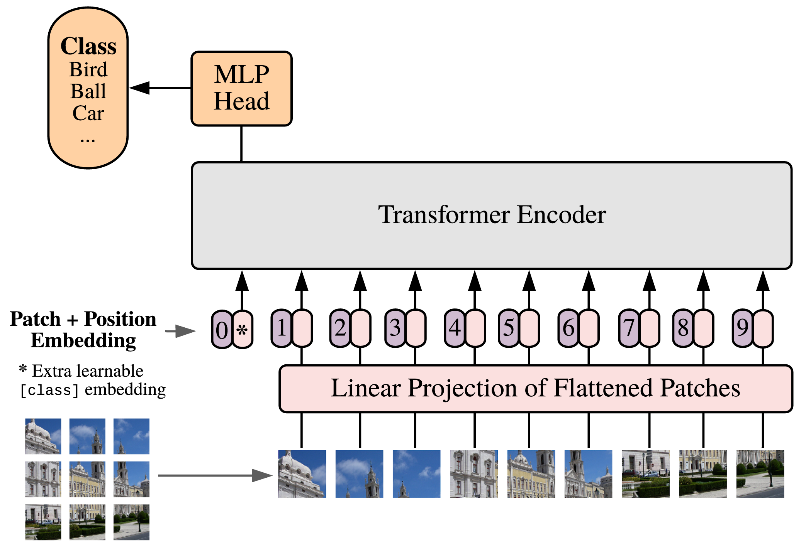

在前面的章节里，我们已经看到 Transformer 如何处理文本序列：一句话可以被切成一个个 token，每个 token 被表示成一个向量，然后 self-attention 在这些 token 之间建立联系。这个思路最开始主要用于自然语言处理，但后来人们发现，只要能把输入整理成序列的形式，Transformer 并不一定只能处理文字。Vision Transformer，也就是 ViT，正是沿着这个方向提出的：它尝试把一张图像也看成一个序列，然后直接使用 Transformer encoder 来完成图像分类。

这件事听起来有点反直觉，因为图像本身并不是一串 token，而是一个二维网格。对于一张彩色图像，我们通常会把它表示成一个形状为 $(C, H, W)$ 的张量，其中 $C$ 是通道数，$H$ 和 $W$ 分别是图像的高度和宽度。CNN 的设计非常自然地利用了这种二维结构：卷积核在图像上滑动，局部地观察相邻像素，并通过层层堆叠逐渐扩大感受野。相比之下，Transformer 原本面对的是一维 token 序列，它并没有内置上下左右相邻这样的图像先验。

因此，ViT 的核心问题不是简单地把 Transformer 搬到图像上，而是要先回答一个更基本的问题：

> **图像应该怎样变成序列？**

## 11.1.1 CNN 如何看图像

在理解 ViT 之前，我们先回顾一下 CNN 是如何处理图像的。

CNN 的基本组件是卷积层。一个卷积核通常只覆盖图像中的一个小窗口，比如 $3 \times 3$ 或 $5 \times 5$，然后在整张图像上共享同一组参数。这样做有两个重要好处：第一，模型天然关注局部区域，因为图像中相邻像素通常关系更密切；第二，同一个卷积核可以在不同位置重复使用，因此模型可以学到某种具有平移共享性质的局部模式，比如边缘、纹理、角点或者更高层的局部结构。

这种设计非常适合图像。比如，在一张猫的图片里，猫耳朵可以出现在左上角，也可以出现在右上角；边缘可以出现在图像的任何位置，但检测边缘的方式本身是类似的。卷积层通过参数共享，把这种同一种模式可能出现在不同位置的先验直接写进了模型结构里。因此，即使训练数据不是特别巨大，CNN 也能比较高效地学习图像特征。

同时，随着网络层数的加深，CNN 的感受野会逐渐变大。浅层卷积可能只看到局部边缘和纹理，中间层可以组合出更复杂的局部形状，深层则可能捕捉到物体部件甚至整个物体的语义信息。这种从局部到整体、从低级特征到高级语义的层级结构，是 CNN 在视觉任务中长期有效的重要原因。

不过，CNN 的这种优势也带来了一种限制。卷积默认从局部区域开始建模，远距离区域之间的信息交互通常需要通过多层网络逐渐传递。虽然深层 CNN 最终也能获得全局信息，但这种全局建模并不是一开始就直接发生的。对于一些需要长距离依赖的视觉问题，比如图像中两个相距很远的区域是否属于同一个物体，CNN 往往需要依赖更深的层、更大的卷积核、池化操作或者额外的结构来增强全局感受能力。

## 11.1.2 Transformer 如何看序列

Transformer 的出发点和 CNN 很不一样。

对于一个长度为 $n$ 的序列，self-attention 会让每个 token 都和其他 token 计算匹配关系，然后根据 attention weights 汇总信息。也就是说，在一层 self-attention 里，任意两个位置之间都可以直接发生信息交互。对于文本来说，这意味着一个词可以直接关注句子中很远的另一个词；对于图像来说，如果我们能把图像也表示成 token 序列，那么图像中相距很远的区域也可以在同一层中直接建立联系。

从公式上看，self-attention 处理的是一组 token 表示。假设输入序列为

$$
X \in \mathbb{R}^{n \times d}
$$

其中 $n$ 是 token 数量，$d$ 是每个 token 的特征维度。经过线性投影后，我们得到 query、key 和 value：

$$
Q = XW_Q, \quad K = XW_K, \quad V = XW_V
$$

然后 scaled dot-product attention 可以写成：

$$
\operatorname{Attention}(Q, K, V)
= \operatorname{softmax}\left(\frac{QK^\top}{\sqrt{d_k}}\right)V
$$

这个公式本身并没有规定 token 必须来自文本。它只要求输入是一组向量，每个向量代表一个位置、一个片段或者一个对象。因此，从这个角度看，Transformer 是一种非常通用的序列建模结构。关键在于：我们该如何把图像中的信息组织成一组 token？

这就是 ViT 要解决的问题。ViT 并不逐个像素地把图像输入 Transformer，而是先把图像切成一个个小块，也就是 patch。每个 patch 可以看成图像中的一个局部区域，然后被转换成一个向量，作为 Transformer 的一个 token。这样，一张图像就从二维网格变成了一维 patch 序列。

## 11.1.3 把图像切成 Patch

假设我们有一张图像：

$$
X \in \mathbb{R}^{C \times H \times W}
$$

其中 $C$ 是通道数，$H$ 和 $W$ 是图像的高和宽。ViT 会把这张图像切成大小相同、不重叠的 patch。假设每个 patch 的大小是 $P \times P$，并且 $H$ 和 $W$ 都能被 $P$ 整除，那么 patch 的数量就是：

$$
N = \frac{H}{P} \times \frac{W}{P}
$$

例如，一张 $224 \times 224$ 的 RGB 图像，如果 patch size 是 $16 \times 16$，那么每个方向上可以切出 14 个 patch，总共有 $14 \times 14 = 196$ 个 patch。于是，这张图像就可以被看成一个长度为 196 的序列。每个 patch 原本是一个形状为 $(C, P, P)$ 的小图像块，把它展平以后就是一个长度为 $C \times P \times P$ 的向量。对于 RGB 图像，$C=3$，如果 $P=16$，那么每个 patch 展平后的维度就是：

$$
3 \times 16 \times 16 = 768
$$

不过，Transformer 通常要求每个 token 的维度是统一的模型维度 $d_{\mathrm{model}}$。因此，ViT 会再用一个线性层把每个展平后的 patch 映射到指定的 embedding 维度。这个过程就叫做 patch embedding。形式上，如果第 $i$ 个 patch 展平后为 $x_i \in \mathbb{R}^{C P^2}$，那么它的 patch embedding 可以写成：

$$
z_i = x_i W_E + b_E
$$

其中 $W_E \in \mathbb{R}^{C P^2 \times d_{\text{model}}}$，$z_i \in \mathbb{R}^{d_{\text{model}}}$。所有 patch 都经过同一个线性投影，最后得到一个形状为

$$
Z \in \mathbb{R}^{N \times d_{\text{model}}}
$$

的 token 序列。

直观来说，patch embedding 做的事情有点像 NLP 里的 word embedding。不同的是，文本里的 token 通常是离散的词，需要通过查表得到向量；图像里的 patch 本身已经是连续像素值，所以可以直接通过线性投影变成向量。经过这一步以后，Transformer 就不再直接处理二维图像，而是处理一串 patch token。

## 11.1.4 为什么不是把每个像素当成 Token

既然 Transformer 可以处理 token 序列，一个自然的问题就是：为什么不把每个像素都当成一个 token？这样不是能保留最细粒度的信息吗？

从信息保留的角度看，这个想法确实很直接，但从计算代价上看，它几乎不可行。

Self-attention 的计算复杂度和 token 数量的平方有关。如果序列长度是 $n$，attention 矩阵的大小就是 $n \times n$。对于一张 $224 \times 224$ 的图像，如果把每个像素当成一个 token，那么 token 数量就是：

$$
224 \times 224 = 50176
$$

这意味着 attention 矩阵会有大约

$$
50176^2 \approx 2.5 \times 10^9
$$

个元素。即使只考虑一层 attention，这样的计算量和显存开销也非常大，更不用说模型通常还要堆叠很多层。这样的计算开销是远远无法接受的。

使用 patch 可以显著减少 token 数量。还是以 $224 \times 224$ 图像为例，如果 patch size 是 $16 \times 16$，那么 token 数量就从 50176 降到了 196。这时 attention 矩阵只有

$$
196 \times 196 = 38416
$$

个元素，计算和显存压力都小了很多。

换句话说，patch 是一种折中：它牺牲了像素级 token 的细粒度表示，但换来了可接受的序列长度，使得 Transformer 可以真正应用到图像上。

这也解释了为什么 patch size 是 ViT 中非常重要的设计选择。patch 太小，token 数量会变多，计算开销会上升；patch 太大，每个 token 覆盖的区域太粗，模型可能丢失一些局部细节。后面我们会看到，ViT 的一个重要局限正是来自这里：当图像分辨率升高，或者任务需要密集预测时，简单的全局 self-attention 会变得越来越昂贵。

## 11.1.5 图像序列和文本序列有什么不同

虽然 ViT 把图像变成了序列，但图像序列和文本序列并不完全一样。文本天然是一个一维序列，词的顺序通常从左到右排列；图像则天然是二维网格，patch 之间同时存在横向和纵向关系。因此，当我们把图像 patch 展平成一维序列时，其实只是为了适配 Transformer 的输入格式。我们并不希望丢掉图像中 patch 之间的空间关系。

例如，一张图像被切成 $14 \times 14$ 个 patch 后，我们可以按照从左到右、从上到下的顺序把它们排成一个长度为 196 的序列。这样做以后，第一个 patch 和第二个 patch 在序列中相邻，它们在图像中也相邻；但第 14 个 patch 和第15 个 patch 在序列中也相邻，可它们在图像中其实位于上一行末尾和下一行开头，并不是水平相邻。因此，单纯的序列顺序并不能完整表达图像中的二维空间关系。

这就是为什么 ViT 也需要 position embedding。Transformer 的 self-attention 本身对输入顺序并不敏感，如果不加入位置信息，它只知道有一组 patch token，却不知道每个 patch 来自图像的哪个位置。对于图像来说，位置非常重要。同样一个局部纹理，如果出现在图像中央，可能是物体主体的一部分；如果出现在边缘，可能只是背景。ViT 通过给每个 patch token 加上 position embedding，让模型能够区分不同空间位置。

不过，ViT 的 position embedding 和 CNN 的局部归纳偏置仍然不同。CNN 从结构上就假设局部邻域很重要，并通过卷积核滑动来显式建模局部关系；ViT 则更多依赖数据学习 patch 之间的关系。它可以在一开始就进行全局交互，但这种灵活性也意味着模型需要更多数据来学会哪些局部模式、空间结构和视觉关系是重要的。

## 11.1.6 ViT 的整体流程

现在，我们可以把 ViT 的整体流程概括出来。

首先，输入图像会被切成固定大小的 patch。然后，每个 patch 被展平并通过一个线性层映射成 patch embedding。接着，模型会在 patch token 序列前面加入一个特殊的 class token，并给所有 token 加上 position embedding。最后，这个序列被送入多层 Transformer encoder，输出的 class token 表示会被用于图像分类。

<figure class="figure" style="text-align: center;">
  
  <figcaption>图 1：ViT 的整体流程 [@dosovitskiy2021ViT, fig. 1]</figcaption>
</figure>

用更形式化的方式表示，假设图像被切成 $N$ 个 patch，经过 patch embedding 后得到：

$$
Z = [z_1, z_2, \dots, z_N]
$$

ViT 会额外引入一个可学习的 class token，记作 $z_{\text{cls}}$。然后把它拼接到 patch token 前面：

$$
Z_0 = [z_{\text{cls}}, z_1, z_2, \dots, z_N] + E_{\text{pos}}
$$

其中，$E_{\text{pos}}$ 是 position embedding。注意，这时序列长度从 $N$ 变成了 $N+1$，因为多了一个 class token。这个 class token 的作用有点像一个用于汇总整张图像信息的特殊位置。经过多层 Transformer encoder 后，class token 会和所有 patch token 反复交互，最终得到一个包含全局图像信息的表示。

最后，我们取 Transformer encoder 输出中的 class token 表示，送入一个分类头：

$$
\hat{y} = \operatorname{MLP}(h_{\text{cls}})
$$

其中，$h_{\text{cls}}$ 是最后一层 Transformer encoder 输出的 class token 表示。

我们来看一个简单的例子。假设输入图像的 batch size 是 $B$，图像大小是 $224 \times 224$，通道数是 3，patch size 是 16，embedding 维度是 768。输入张量形状可以写成：

$$
X \in \mathbb{R}^{B \times 3 \times 224 \times 224}
$$

切成 patch 后，每张图像会得到 $14 \times 14 = 196$ 个 patch。每个 patch 的原始维度是 $3 \times 16 \times 16 = 768$。如果把每个 patch 展平，形状可以理解为：

$$
X_{\text{patch}} \in \mathbb{R}^{B \times 196 \times 768}
$$

经过 patch embedding 后，如果 embedding 维度仍然是 768，那么 token 序列形状还是：

$$
Z \in \mathbb{R}^{B \times 196 \times 768}
$$

接着加入 class token，序列长度变成 197：

$$
Z_0 \in \mathbb{R}^{B \times 197 \times 768}
$$

再加上 position embedding 后，形状不变。这个序列会被送入 Transformer Encoder，输出形状仍然是：

$$
H \in \mathbb{R}^{B \times 197 \times 768}
$$

最后取第一个位置，也就是 class token 对应的输出：

$$
H_{\text{cls}} \in \mathbb{R}^{B \times 768}
$$

再通过分类头得到类别 logits：

$$
\hat{Y} \in \mathbb{R}^{B \times \text{num\_classes}}
$$

这样，ViT 就完成了从图像到类别预测的过程。

从整体上看，ViT 并没有为图像设计复杂的卷积结构，而是尽可能把图像处理转化成序列建模问题。它的关键步骤可以概括为：切 patch，做 embedding，加 class token 和 position embedding，送入 Transformer encoder，用 class token 分类。后面的几节会围绕这些步骤逐步展开。

## 11.1.7 CNN 与 ViT 的差异

CNN 和 ViT 都可以用于图像分类，但它们对图像的基本假设不同。CNN 更强调局部性和层级结构。它从局部窗口出发，通过卷积、非线性、池化和层级堆叠，逐渐把局部模式组合成全局语义。ViT 则把图像分成 patch token，然后使用 self-attention 直接建模 token 之间的关系。它不再强制模型从局部到全局地处理图像，而是允许每个 patch 在每一层都和所有其他 patch 交互。

这种差异可以从归纳偏置的角度理解。归纳偏置指的是模型结构中预先加入的假设。CNN 的归纳偏置很强，比如局部连接、参数共享和平移等变性。这些假设非常适合自然图像，因此 CNN 在数据量有限时也能表现很好。ViT 的归纳偏置相对弱，它没有那么强地预设局部结构，而是更依赖数据去学习图像中的空间关系。因此，ViT 通常需要更大的数据集和更强的训练策略，才能充分发挥优势。

这并不意味着 CNN 一定比 ViT 好，或者 ViT 一定比 CNN 好，它们更像是两种不同的建模思路。CNN 把很多视觉先验写进结构里，所以更高效、更稳定；ViT 则减少了手工设计的视觉结构，让模型用更统一的 Transformer 框架处理图像，因此在大规模数据和大模型条件下具有很强的扩展性。后来的许多视觉模型，也在尝试结合两者的优点，比如既保留局部窗口或层级结构，又利用 attention 的全局建模能力。

## 11.1.8 本章小结

本节我们从 CNN 出发，讨论了 Vision Transformer 的基本动机。CNN 通过局部卷积、参数共享和层级结构来处理图像，这些设计非常符合自然图像的特点，也让 CNN 在很长时间里成为视觉任务的主流方法。Transformer 则提供了另一种思路：只要能把输入表示成 token 序列，就可以使用 self-attention 在 token 之间建立关系。

ViT 的关键想法是把图像切成 patch，把每个 patch 看成一个 token。这样，图像就从二维网格变成了一维序列，可以直接输入 Transformer encoder。为了让模型知道每个 patch 的空间位置，ViT 还需要加入 position embedding；为了得到整张图像的分类表示，ViT 通常会加入一个 class token，并使用它的最终输出进行分类。

从建模方式上看，CNN 更依赖图像领域的结构先验，而 ViT 更依赖数据和 self-attention 的通用建模能力。理解这一点很重要，因为它不仅解释了 ViT 为什么需要大量数据，也为后面理解 patch embedding、class token、position embedding、ViT encoder 以及 DeiT 等改进方法打下基础。

下一节我们会更具体地讨论 patch embedding：图像到底是怎样被切成 token 的，以及这个过程在代码中如何实现。
