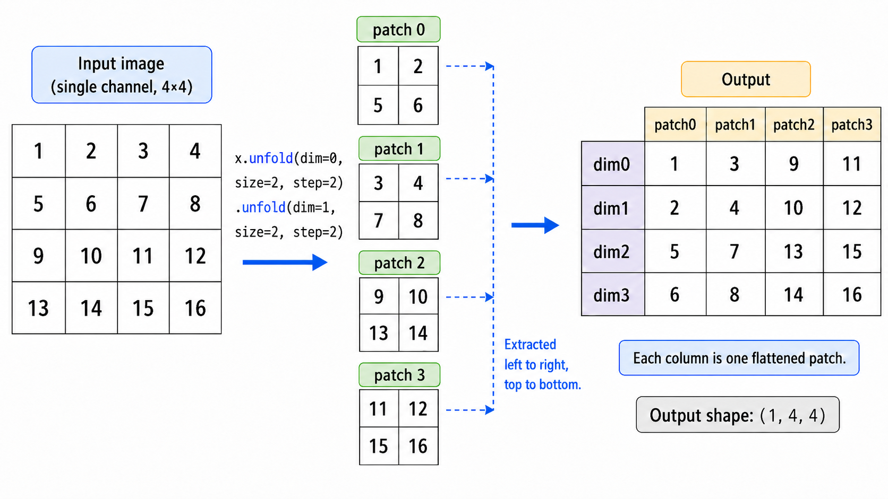

上一节里，我们从整体上介绍了 Vision Transformer 的核心想法：把图像切成 patch，然后把这些 patch 当成一串视觉 token 交给 Transformer 处理。

不过，上一节只讲了概念，还没有真正回答一个实现层面的问题：一张形状为 $(B, C, H, W)$ 的图像，怎么变成 Transformer 可以接收的序列？

Transformer 期望的输入通常是一个三维张量：

$$
X \in \mathbb{R}^{B \times N \times D}
$$

其中 $B$ 是 batch size，$N$ 是序列长度，$D$ 是每个 token 的 embedding 维度。

而图像的原始形状是：

$$
I \in \mathbb{R}^{B \times C \times H \times W}
$$

所以，Patch Embedding 要做的事情就是把图像从 $(B, C, H, W)$ 转换成 $(B, N, D)$。

这一节我们就专门讨论这个过程。它看起来只是一个输入变换，但其实是 ViT 中非常关键的一步：它决定了图像如何被 token 化，也决定了后面 Transformer 看到的序列长度和每个 token 的初始表示。

```{python}
import torch
import torch.nn as nn
from torch import Tensor

print('PyTorch version:', torch.__version__)
```

## 11.2.1 从图像到 patch 网格

假设输入是一张大小为 $H \times W$ 的图像，每个 patch 的大小是 $P \times P$。为了简单起见，我们先假设 $H$ 和 $W$ 都可以被 $P$ 整除。

那么，沿着高度方向可以切出

$$
\frac{H}{P}
$$

个 patch，沿着宽度方向可以切出

$$
\frac{W}{P}
$$

个 patch。因此，一张图像总共会被切成

$$
N = \frac{H}{P} \times \frac{W}{P}
$$

个 patch。

例如，如果图像大小是 $224 \times 224$，patch 大小是 $16 \times 16$，那么每个方向上都有 14 个 patch，总共有

$$
N = 14 \times 14 = 196
$$

个 patch。

这 196 个 patch 就对应 ViT 输入序列里的 196 个视觉 token。也就是说，ViT 并不是把一张图像看成 50176 个像素 token，而是把它看成 196 个 patch token。

从这个角度看，patch size $P$ 会直接影响序列长度。$P$ 越小，patch 越多，序列越长；$P$ 越大，patch 越少，序列越短。因为 self-attention 的复杂度和序列长度的平方有关，所以 patch size 是 ViT 中一个非常重要的超参数。

## 11.2.2 每个 patch 如何变成向量

切出 patch 以后，每个 patch 仍然是一个小图像块。对于 RGB 图像来说，一个 patch 的形状是：

$$
(C, P, P)
$$

Transformer 不能直接处理这个三维小块。它需要的是一个向量。因此，最直接的做法是把每个 patch 展平成一个一维向量：

$$
(C, P, P) \rightarrow (C P^2)
$$

如果 $C = 3$，$P = 16$，那么每个 patch 展平以后就是：

$$
3 \times 16 \times 16 = 768
$$

维向量。

不过，展平以后得到的 $C P^2$ 维向量还不一定就是 Transformer 使用的 embedding 维度。ViT 通常会再用一个线性层，把每个 patch 向量投影到指定的 embedding 维度 $D$：

$$
z_i = x_i W + b
$$

其中 $x_i \in \mathbb{R}^{C P^2}$ 是第 $i$ 个展平后的 patch，$z_i \in \mathbb{R}^{D}$ 是对应的 patch embedding。

如果把所有 patch 放在一起，那么这个过程可以写成：

$$
(B, N, C P^2) \rightarrow (B, N, D)
$$

这就是 patch embedding 的基本含义：

> **先把图像切成 patch，再把每个 patch 展平成向量，最后用线性层投影成 Transformer 的 token embedding。**

## 11.2.3 手动实现 patchify

我们先用最直观的方式实现 patchify。这里的目标不是追求最高效率，而是看清楚张量形状是如何变化的。

假设输入图像的形状是 `(batch_size, channels, height, width)`，也就是 PyTorch 中常见的 NCHW 格式。我们希望把它切成大小为 `patch_size x patch_size` 的小块，然后展平成 `(batch_size, num_patches, patch_dim)` 的形状。

下面是一个教学版实现：

```{python}
def patchify(x: Tensor, patch_size: int) -> Tensor:
    batch_size, channels, height, width = x.size()
    if height % patch_size != 0 or width % patch_size != 0:
        raise AssertionError(
            'Image height and width must be divisible by `patch_size`.'
        )

    num_patches_h = height // patch_size
    num_patches_w = width // patch_size

    # (B, C, num_patches_h, W, patch_size)
    x = x.unfold(2, patch_size, patch_size)
    # (B, C, num_patches_h, num_patches_w, patch_size, patch_size)
    x = x.unfold(3, patch_size, patch_size)
    # (B, num_patches_h, num_patches_w, C, patch_size, patch_size)
    x = x.permute(0, 2, 3, 1, 4, 5)
    # NOTE: We can't use `view` here because the tensor is not
    # contiguous after `permute`.
    # (B, num_patches_h * num_patches_w, C * patch_size * patch_size)
    x = x.reshape(batch_size, num_patches_h * num_patches_w, -1)
    return x
```

我们用一个小例子来看一下它的输出形状：

```{python}
batch_size = 2
channels = 3
height = 224
width = 224
patch_size = 16

x = torch.randn(batch_size, channels, height, width)
patches = patchify(x, patch_size)

print('Input shape:', x.shape)
print('Patch shape:', patches.shape)
```

输出的 patch 形状应该是：

```text
(batch_size, num_patches, patch_dim)
```

在这个例子里，图像大小是 $32 \times 32$，patch 大小是 $8 \times 8$，所以每张图像有：

$$
\frac{32}{8} \times \frac{32}{8} = 16
$$

个 patch。每个 patch 展平后的维度是：

$$
3 \times 8 \times 8 = 192
$$

因此最终输出形状是 `(2, 16, 192)`。

这里最容易混乱的是 `unfold` 和 `permute`。我们可以分三步理解：

第一步，用 `unfold` 把高度和宽度分别拆开。一部分表示“这是第几个 patch”，另一部分表示“这是 patch 里面的第几个像素”：

$$
(B, C, H, W)
\xrightarrow{\operatorname{unfold}(2, P, P)}
\left(B, C, \frac{H}{P}, W, P\right)
\xrightarrow{\operatorname{unfold}(3, P, P)}
\left(B, C, \frac{H}{P}, \frac{W}{P}, P, P\right)
$$

第二步，用 `permute` 调整维度顺序。我们希望先按 patch 在原图中的网格位置排列，也就是先放 `H/P` 和 `W/P`；然后再放每个 patch 内部自己的内容，也就是通道维度 `C` 和 patch 内部的 `P x P` 空间位置：

$$
\left(B, C, \frac{H}{P}, \frac{W}{P}, P, P\right)
\rightarrow
\left(B, \frac{H}{P}, \frac{W}{P}, C, P, P\right)
$$

第三步，把二维 patch 网格展平成一维序列，同时把每个 patch 内部展平成向量：

$$
\left(B, \frac{H}{P}, \frac{W}{P}, C, P, P\right)
\rightarrow
(B, N, C \times P^2)
$$

这样，我们就得到了一个 patch 序列。

<figure class="figure" style="text-align: center;">
  
  <figcaption>图 1：Tensor.unfold 计算流程</figcaption>
</figure>

::: {.callout-tip}
相比使用两次 `Tensor.unfold`，我们也可以直接使用 `nn.Unfold` 来实现。

对于输入 $x \in \mathbb{R}^{B \times C \times H \times W}$，如果我们设置 `nn.Unfold(kernel_size=P, stride=P)`，它会自动帮我们完成上面三步的操作，直接输出一个形状为 $(B, C \times P^2, N)$ 的张量。我们只需要再转置一下维度，就得到了 $(B, N, C \times P^2)$。
:::

## 11.2.4 用 `Linear` 实现 Patch Embedding

得到展平后的 patch 序列以后，我们还需要把每个 patch 向量投影到统一的 embedding 维度。这个过程可以直接用 `nn.Linear` 实现。

```{python}
class ViTLinearPatchEmbedding(nn.Module):
    def __init__(
        self,
        image_size: int = 224,
        patch_size: int = 16,
        in_channels: int = 3,
        embed_dim: int = 768,
    ):
        super().__init__()
        if image_size % patch_size != 0:
            raise AssertionError('image_size must be divisible by patch_size.')

        self.image_size = image_size
        self.patch_size = patch_size
        self.num_patches = (image_size // patch_size) ** 2
        self.proj = nn.Linear(in_channels * patch_size * patch_size, embed_dim)

    def forward(self, x: Tensor) -> Tensor:
        patches = patchify(x, self.patch_size)
        embeddings = self.proj(patches)
        return embeddings
```

测试一下输出形状：

```{python}
patch_embed = ViTLinearPatchEmbedding(
    image_size=32,
    patch_size=8,
    in_channels=3,
    embed_dim=64,
)

x = torch.randn(2, 3, 32, 32)
out = patch_embed(x)

print('Patch embedding output shape:', out.shape)
print('Number of patches:', patch_embed.num_patches)
```

输出形状是 `(2, 16, 64)`。这说明每张图像被切成 16 个 patch，每个 patch 被映射成一个 64 维 token embedding。

这时，图像已经变成了 Transformer 可以处理的序列形式：

$$
(B, C, H, W) \rightarrow (B, N, D)
$$

后面的 Transformer Encoder 就可以把这 $N$ 个 patch token 当作普通 token 序列来处理。

## 11.2.5 用 `Conv2d` 实现 Patch Embedding

上面的实现很直观，但实际 ViT 代码里更常见的写法是用 `nn.Conv2d` 实现 patch embedding。这看起来有点奇怪：ViT 不是想摆脱 CNN 吗？为什么输入层又用了卷积？

关键在于，这里的卷积不是用来堆叠局部特征提取器，而是用来高效完成切 patch + 线性投影这件事。

如果我们使用一个卷积层：

```python
nn.Conv2d(
    in_channels=C,
    out_channels=D,
    kernel_size=P,
    stride=P,
)
```

那么它会在图像上以 $P$ 为步幅滑动一个 $P \times P$ 的卷积核。因为 `kernel_size = stride = patch_size`，所以这些窗口刚好是不重叠的 patch。对于每一个 patch，卷积层会把形状为 $(C, P, P)$ 的局部区域映射成一个 $D$ 维输出。这个过程和展平 patch 后接一个线性层在形式上是等价的。

也就是说：

$$
\text{patchify} + \text{linear projection}
\quad \Longleftrightarrow \quad
\operatorname{Conv2d}(\text{kernel\_size}=P, \text{stride}=P)
$$

下面是用 `Conv2d` 实现的 patch embedding：

```{python}
class ViTConvPatchEmbedding(nn.Module):
    def __init__(
        self,
        image_size: int = 224,
        patch_size: int = 16,
        in_channels: int = 3,
        embed_dim: int = 768,
    ):
        super().__init__()
        if image_size % patch_size != 0:
            raise AssertionError('image_size must be divisible by patch_size.')

        self.image_size = image_size
        self.patch_size = patch_size
        self.num_patches = (image_size // patch_size) ** 2

        self.proj = nn.Conv2d(
            in_channels=in_channels,
            out_channels=embed_dim,
            kernel_size=patch_size,
            stride=patch_size,
        )

    def forward(self, x: Tensor) -> Tensor:
        x = self.proj(x)
        x = x.flatten(2)
        x = x.transpose(1, 2)
        return x
```

测试一下：

```{python}
patch_embed = ViTConvPatchEmbedding(
    image_size=32,
    patch_size=8,
    in_channels=3,
    embed_dim=64,
)

x = torch.randn(2, 3, 32, 32)
out = patch_embed(x)

print('Patch embedding output shape:', out.shape)
print('Number of patches:', patch_embed.num_patches)
```

这里 `Conv2d` 的输出形状是：

$$
(B, D, H/P, W/P)
$$

这仍然是一个二维特征图。为了交给 Transformer，我们需要把后两个空间维度展平成序列长度：

```python
x = x.flatten(2)      # (B, D, H/P * W/P)
x = x.transpose(1, 2) # (B, N, D)
```

最终得到的形状还是：

$$
(B, N, D)
$$

因此，用 `Conv2d` 写 patch embedding 只是一个更简洁、更高效的工程实现。它并不意味着 ViT 又变回了传统 CNN。这里的卷积层只负责把图像切成 patch token，而不是像 CNN 那样通过多层局部卷积逐步提取层级特征。

## 11.2.6 两种实现为什么等价？

我们可以更具体地理解一下 `Linear` 版本和 `Conv2d` 版本的关系。

对于一个 patch，展平后是一个向量：

$$
x_i \in \mathbb{R}^{C P^2}
$$

线性层的权重是：

$$
W \in \mathbb{R}^{D \times C P^2}
$$

输出是：

$$
z_i = W x_i + b
$$

而 `Conv2d` 中，每个输出通道都有一个大小为 $(C, P, P)$ 的卷积核。如果把这个卷积核展平，它同样是一个长度为 $C P^2$ 的向量。对某个 patch 做卷积，本质上就是用这个展平后的卷积核和 patch 向量做内积。

由于一共有 $D$ 个输出通道，所以就相当于有 $D$ 个这样的线性投影方向。把它们放在一起，就等价于一个从 $C P^2$ 到 $D$ 的线性层。

区别只在于实现方式：

- `patchify + Linear` 更符合概念，适合教学；
- `Conv2d(kernel_size=P, stride=P)` 更简洁，也更接近很多实际 ViT 实现。

当然，我们也可以手动把 `Linear` 的权重复制到 `Conv2d` 里，验证两者输出一致。

## 11.2.7 Patch size 的影响

Patch size 不只是一个实现细节，它会影响 ViT 的计算量和建模方式。

假设图像大小固定为 $H \times W$，patch size 是 $P$，那么序列长度是：

$$
N = \frac{H}{P} \times \frac{W}{P}
$$

如果 $P$ 变小，patch 数量会增加，序列会变长。这样每个 token 覆盖的局部区域更小，图像细节保留得更多，但 self-attention 的计算和内存开销也会明显增加。

如果 $P$ 变大，patch 数量会减少，序列会变短。这样计算更便宜，但每个 token 覆盖的区域更大，细粒度空间信息可能会损失更多。

例如，对于 $224 \times 224$ 的图像：

::: {.list-table}
表 1：不同 patch size 对序列长度的影响

- - Patch size
  - Patch 网格
  - 序列长度 $N$

- - $8 \times 8$
  - $28 \times 28$
  - $784$

- - $16 \times 16$
  - $14 \times 14$
  - $196$

- - $32 \times 32$
  - $7 \times 7$
  - $49$
:::

由于 attention 矩阵大小大约是 $N \times N$，所以从 $16 \times 16$ patch 改成 $8 \times 8$ patch，不只是序列长度变成 4 倍，attention 矩阵规模会变成大约 16 倍。

这也是为什么原始 ViT [@dosovitskiy2021ViT] 中常见的设置是 `patch_size=16`。它在序列长度、计算成本和图像细节之间提供了一个比较实用的折中。

当然，patch size 并不是越小越好，也不是越大越好。它和数据规模、模型大小、任务类型、输入分辨率都有关系。对于图像分类，较大的 patch 有时已经足够；对于检测和分割这类密集预测任务，细粒度空间信息更加重要，因此直接使用普通 ViT 结构会遇到一些困难。这些问题会在后面讨论 ViT 局限和后续视觉 Transformer 变体时再展开。

## 11.2.8 本章小结

这一节我们讨论了 ViT 中的 patch embedding。

Patch embedding 的目标，是把原始图像张量：

$$
(B, C, H, W)
$$

转换成 Transformer 可以处理的序列张量：

$$
(B, N, D)
$$

具体来说，ViT 会先把图像切成大小为 $P \times P$ 的 patch。每个 patch 展平成 $C P^2$ 维向量，再通过一个线性层投影到 embedding 维度 $D$。

在实现上，patch embedding 可以用两种方式完成。第一种是显式地 `patchify`，然后接 `nn.Linear`；第二种是使用 `nn.Conv2d(kernel_size=P, stride=P)`。后者在数学上等价于切 patch + 线性投影，也是实际实现中更常见的写法。

但这还不是 ViT Encoder 的完整输入。原因有两个：

第一，Transformer 本身并不知道 token 的位置。Patch embedding 只是把每个 patch 转成向量，但如果没有额外位置信息，模型很难区分某个 patch 来自图像左上角还是右下角。图像虽然被展开成序列，但它原本的二维空间结构不能完全丢掉。

第二，对于图像分类任务，我们通常需要一个整张图像的表示。Patch token 表示的是局部图像块，那么最后应该用哪个 token 来代表整张图？ViT 的常见做法是在 patch 序列前面加入一个可学习的 class token，让它在 Transformer 中和所有 patch 交互，最终作为整图表示。

所以，patch embedding 只完成了 ViT 输入模块的第一步。下一节我们会继续讨论：如何加入 class token 和 position embedding，让这串 patch token 真正成为 ViT Encoder 的输入。
